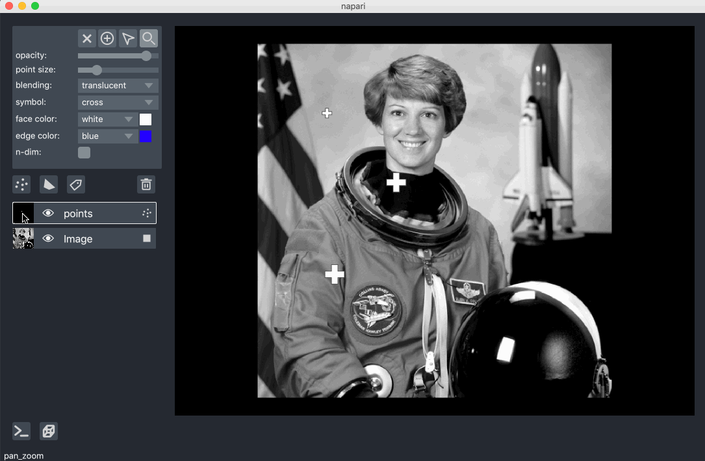

# napari

### multi-dimensional image viewer for python

[](https://github.com/napari/napari/raw/master/LICENSE)
[](https://cirrus-ci.com/napari/napari)
[](https://codecov.io/gh/napari/napari)
[](https://python.org)
[](https://pypi.org/project/napari)
[](https://pypistats.org/packages/napari)
[](https://github.com/napari/napari)
[](https://github.com/python/black)

**napari** is a fast, interactive, multi-dimensional image viewer for Python. It's designed for browsing, annotating, and analyzing large multi-dimensional images. It's built on top of `Qt` (for the GUI), `vispy` (for performant GPU-based rendering), and the scientific Python stack (`numpy`, `scipy`).

We're developing **napari** in the open! But the project is in an **alpha** stage, and there will still likely be **breaking changes** with each release. You can follow progress on this repository, test out new versions as we release them, and contribute ideas and code.

We're working on [in-depth tutorials](https://napari.github.io/napari-tutorials/), but you can also quickly get started by looking below.

## installation

**napari** can be installed on most macOS and Linux systems with Python 3.6 or 3.7 by calling

```sh
$ pip install napari
```

We're working on improving Windows support. For mac0S we also require at least version 10.12.

To install from the master branch on Github use

```sh
$ pip install git+https://github.com/napari/napari
```

To clone the repository locally and install in editable mode use

```sh
$ git clone https://github.com/napari/napari.git
$ cd napari
$ pip install -e .
```

For more information see our [installation tutorial](https://napari.github.io/napari-tutorials/tutorials/installation)

## simple example

From inside an IPython shell (started with `ipython --gui=qt`) or Jupyter notebook (after running a cell with magic command `%gui qt5`) you can open up an interactive viewer by calling

```python
from skimage import data
import napari
viewer = napari.view_image(data.astronaut(), rgb=True)
```


To do the same thing inside a script call

```python
from skimage import data
import napari

with napari.gui_qt():
    viewer = napari.view_image(data.astronaut(), rgb=True)
```

## features

Check out the scripts in the `examples` folder to see some of the functionality we're developing!

napari support six main different layer types, `Image`, `Labels`, `Points`, `Vectors`, `Shapes`, and `Surface`, each corresponding to a different data type, visualization, and interactivity. You can add multiple layers of all the different types into the viewer and then start working with them and adjusting their properties.

For example, you can add points on top of an image with a `Points` layer as seen in this example:

```python
import numpy as np
from skimage import data
from skimage.color import rgb2gray
import napari

with napari.gui_qt():
    # add an image
    viewer = napari.view_image(rgb2gray(data.astronaut()))
    # create three xy coordinates
    points = np.array([[100, 100], [200, 200], [333, 111]])
    # specify three sizes
    size = np.array([10, 20, 20])
    # add them to the viewer
    viewer.add_points(points, size=size)
```


**napari** supports bidirectional communication between the viewer and the Python kernel, which is especially useful in Jupyter notebooks or from our built-in console. In this you can retrieve the locations of the points, including any additional ones you have drawn, by calling

```python
>>> viewer.layers['points'].data
[[100, 100],
 [200, 200],
 [333, 111]]
```



You can also draw lines and polygons on an image with a `Shapes` layer. You can then adjust the properties of then shapes and vertices, including their positions and fill and stroke colors. Run `examples/add_shapes.py` to generate and interact with the following example:


You can also paint pixel-wise labels with a `Labels` layer, which is useful for creating masks for segmentation. Run `examples/add_labels.py` to generate and interact with the following example:


You can render and quickly browse slices of multi-dimensional arrays in 2D or visualize them in 3D. Run `examples/nD_labels.py` to generate and interact with the following example:


## tutorials

For more details on how to use `napari` checkout our [in-depth tutorials](https://napari.github.io/napari-tutorials/). These are still a work in progress, but we'll be updating them regularly.

## plans

We're working on several features, including

- support for multiple linked canvases
- a plugin ecosystem for integrating image processing and machine learning tools

See [this issue](https://github.com/napari/napari/issues/420) for some of the features on the roadmap for our `0.3` release. Feel free to add comments or ideas!

## contributing

Contributions are encouraged! Please read our [contributing guide](CONTRIBUTING.md) to get started. Given that we're in an early stage, you may want to reach out on [Github Issues](https://github.com/napari/napari/issues) before jumping in.

## help
We're a community partner on the [imagesc forum](https://forum.image.sc/tags/napari) and all help and support requests should be posted on the forum with the tag `napari`. We look forward to interacting with you there.
