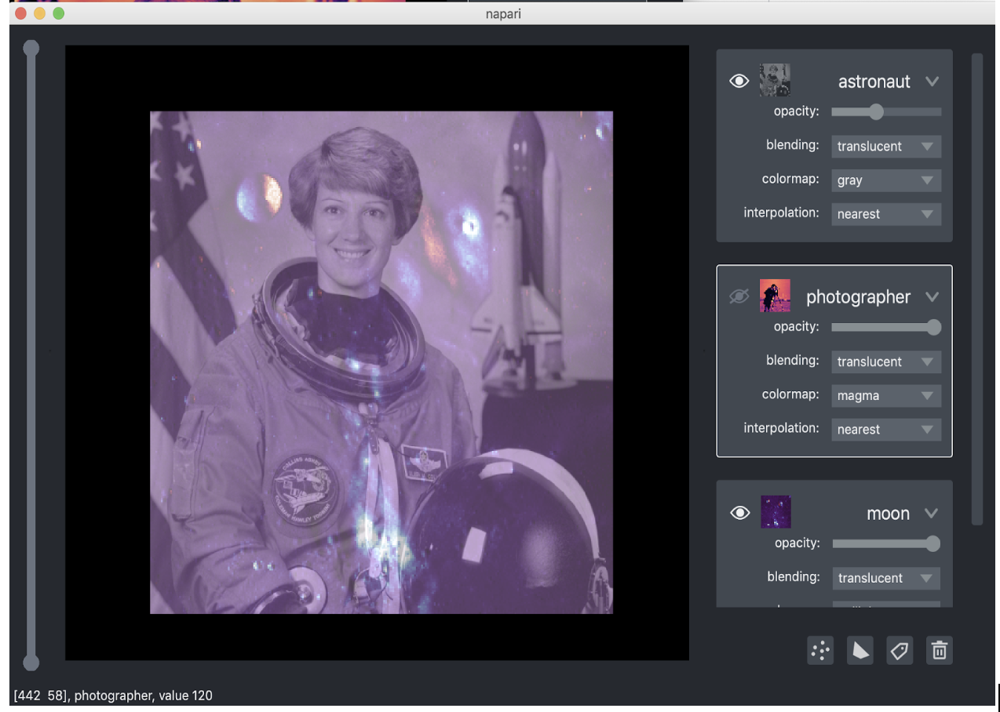
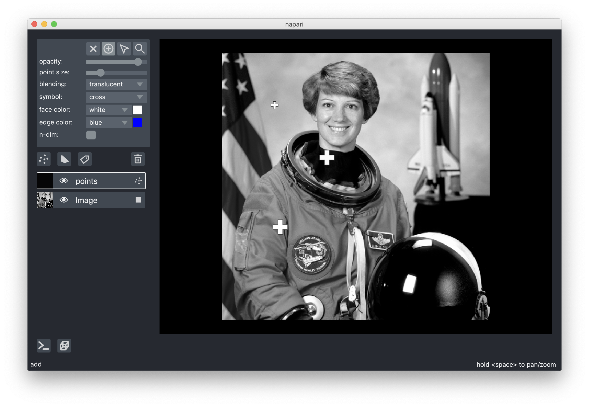
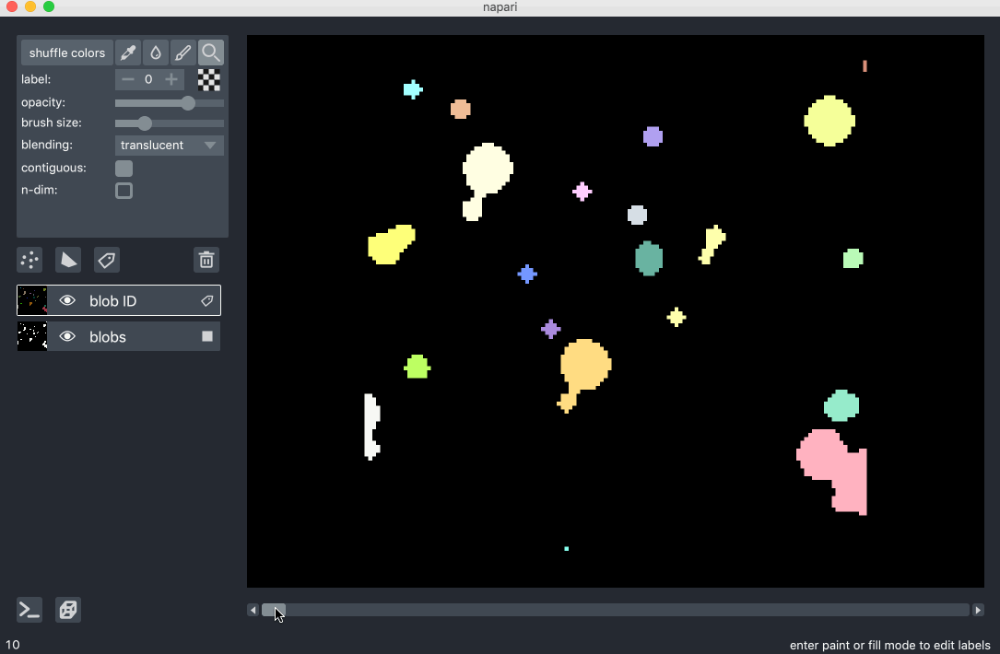
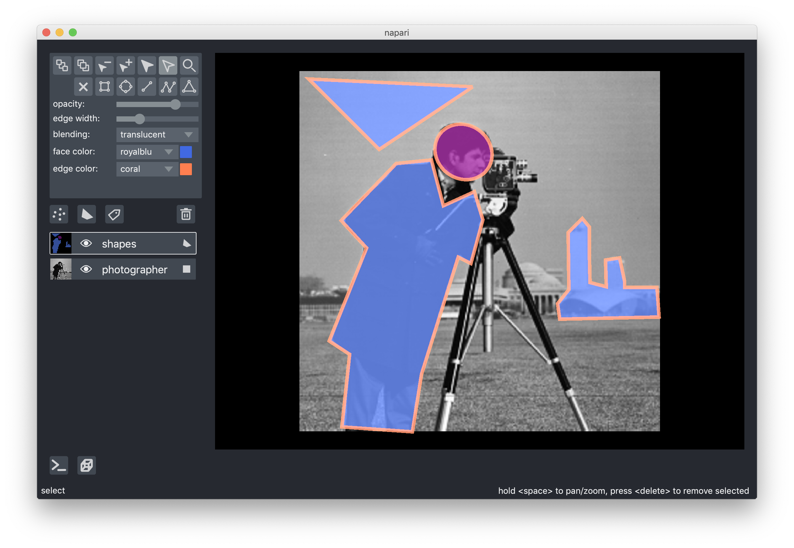
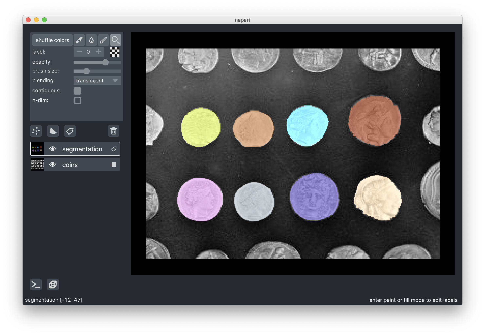
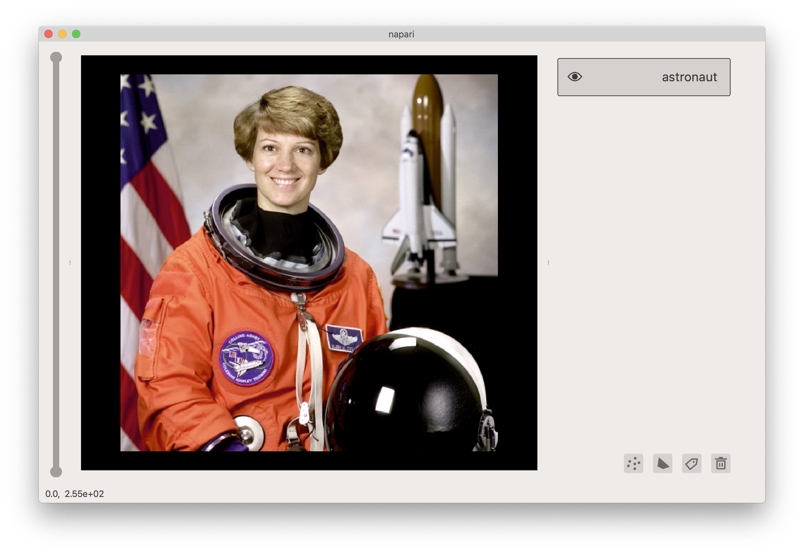

# napari

### multi-dimensional image viewer for python

[](https://github.com/napari/napari/raw/master/LICENSE)
[](https://cirrus-ci.com/napari/napari)
[](https://python.org)
[](https://pypi.org/project/napari)
[](https://pypistats.org/packages/napari)
[](https://github.com/napari/napari)
[](https://github.com/python/black)

**napari** is a fast, interactive, multi-dimensional image viewer for Python. It's designed for browsing, annotating, and analyzing large multi-dimensional images. It's built on top of `PyQt` (for the GUI), `vispy` (for performant GPU-based rendering), and the scientific Python stack (`numpy`, `scipy`).

We're developing **napari** in the open! But the project is in an **alpha** stage, and there will still occasionally be **breaking changes** from patch to patch. You can follow progress on this repository, test out new versions as we release them, and contribute ideas and code.

## installation

**napari** can be installed on most Mac OS X and Linux systems with Python 3.6 or 3.7 by calling

```sh
$ pip install napari
```

(We're working on adding Windows support.)

To install from the master branch on Github use

```sh
$ pip install git+https://github.com/napari/napari
```

To clone the repository locally and install in editable mode use

```sh
$ git clone https://github.com/napari/napari.git
$ cd napari
$ pip install -e .
```

Note that many of our examples use `data` from `skimage` but `skimage` is otherwise not a dependnecy, so in order to be able to run all the examples you should call

```sh
$ pip install scikit-image
```

## simple example

From inside an IPython shell or Jupyter notebook you can open up an interactive viewer by calling

```python
%gui qt5
from skimage import data
import napari
viewer = napari.view(data.astronaut(), multichannel=True)
```


To do the same thing inside a script call

```python
from skimage import data
import napari

with napari.gui_qt():
    viewer = napari.view(data.astronaut())
```

## features

Check out the scripts in the `examples` folder to see some of the functionality we're developing!

For example, you can add multiple images in different layers and tweak their opacity on GUI to see blended images

```python
from skimage import data
from skimage.color import rgb2gray
import napari

with napari.gui_qt():
    # create the viewer with four layers
    viewer = napari.view(astronaut=rgb2gray(data.astronaut()),
                         photographer=data.camera(),
                         coins=data.coins(),
                         moon=data.moon())
    # remove a layer
    viewer.layers.remove('coins')
    # swap layer order
    viewer.layers['astronaut', 'moon'] = viewer.layers['moon', 'astronaut']
```



You can add points on top of an image

```python
import numpy as np
from skimage import data
from skimage.color import rgb2gray
import napari

with napari.gui_qt():
    # set up viewer
    viewer = napari.Viewer()
    viewer.add_image(rgb2gray(data.astronaut()))
    # create three xy coordinates
    points = np.array([[100, 100], [200, 200], [333, 111]])
    # specify three sizes
    size = np.array([10, 20, 20])
    # add them to the viewer
    points = viewer.add_points(points, size=size)
```



**napari** supports bidirectional communication between the viewer and the Python kernel, which is especially useful in Jupyter notebooks -- in the example above you can retrieve the locations of the points, including any additional ones you have drawn, by calling

```python
>>> points.data
[[100, 100],
 [200, 200],
 [333, 111]]
```

You can render and quickly browse slices of multi-dimensional arrays

```python

import numpy as np
from skimage import data
import napari

with napari.gui_qt():
    # create fake 3d data
    blobs = np.stack([data.binary_blobs(length=128, blob_size_fraction=0.05,
                                        n_dim=3, volume_fraction=f)
                     for f in np.linspace(0.05, 0.5, 10)], axis=0)
    # add image data to the viewer
    viewer = napari.view(blobs.astype(float))

    # add points to the viewer
    points = np.array(
        [
            [0, 0, 100, 100],
            [0, 0, 50, 120],
            [1, 0, 100, 40],
            [2, 10, 110, 100],
            [9, 8, 80, 100],
        ]
    )
    viewer.add_points(
        points, size=[0, 6, 10, 10], face_color='blue', n_dimensional=True
    )

```



You can draw lines and polygons on an image, including selection and adjustment of shapes and vertices, and control over fill and stroke color. Run `examples/add_shapes.py` to generate and interact with the following example.



You can also paint pixel-wise labels, useful for creating masks for segmentation, and fill in closed regions using the paint bucket. Run `examples/add_labels.py` to generate and interact with the following example.



You can change the theme after creating the viewer by setting the `viewer.theme` property. The viewer currently supports `light` and `dark` themes, with `dark` as the default. Run `examples/set_theme.py` to see an example of changing themes.



## plans

We're working on several features, including

- support for 3D volumetric rendering
- support for multiple canvases
- a plugin ecosystem for integrating image processing and machine learning tools

See [this issue](https://github.com/napari/napari/issues/301) for some of the features on the roadmap for our `0.2` release. Feel free to add comments or ideas!

## contributing

Contributions are encouraged! Please read [our guide](https://github.com/napari/napari/blob/master/CONTRIBUTING.md) to get started. Given that we're in an early stage, you may want to reach out on [Github Issues](https://github.com/napari/napari/issues) before jumping in.
