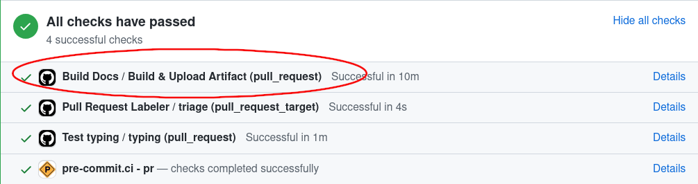

(docs_contributing_guide)=
# Contributing Documentation

This guide will teach you how to submit new documents to napari's usage
documentation.

## Organization of the documentation

The napari documentation is built from multiple sources that are organized into repositories:
1. The main napari documentation is built from sources located at the
[napari/docs](https://github.com/napari/docs) repository on GitHub.
That repository is where all the narrative documentation (e.g. tutorials, how-to
guides, etc. on napari.org) pull requests should be made.
This narrative napari documentation is written in
[MyST markdown](https://myst-parser.readthedocs.io/en/latest/index.html),
a version of [commonmark](https://spec.commonmark.org/) Markdown
(see a [markdown cheatsheet](https://github.com/adam-p/markdown-here/wiki/Markdown-Cheatsheet))
with some additional features.
2. Some of the documentation about [plugins](https://napari.org/plugins) resides in
the [napari/npe2](https://github.com/napari/npe2) repository
(e.g. the [contributions reference page](https://napari.org/plugins/contributions.html)) and should be modified there.
This is documentation is written with [Jinja](https://jinja.palletsprojects.com/en/3.1.x/).
3. The [examples gallery](https://napari.org/gallery) is generated from Python source files and changes to the gallery should be made to the
[napari/napari](https://github.com/napari/napari) repository (see also
[the guide on adding examples to the gallery](add-examples)).
4. Changes to how [napari.org](https://napari.org/dev) appears site-wide are made to the
[napari-sphinx-theme](https://github.com/napari/napari-sphinx-theme).
5. The [API reference documentation](https://napari.org/dev/api/index.html) is autogenerated from the napari source code docstrings.
Docstrings are written in the [reStructuredText format](https://www.sphinx-doc.org/en/master/usage/restructuredtext/basics.html)
and any modifications to them should be submitted to the [napari/napari](https://github.com/napari/napari) repository.

(contributing-without-local-setup)=
## Contributing to the napari documentation without a local setup

If you would like to see new documentation added to napari or want to see changes to existing documentation, but are not clear on these instructions or don't have the time to write it yourself, you can [open an issue](https://github.com/napari/docs/issues/new/choose).

If you are adding new documentation or modifying existing documentation and would prefer a simpler workflow than the local setup guide described below,
you can use the GitHub web interface to open your pull request
by either [uploading file(s) from your computer](https://docs.github.com/en/repositories/working-with-files/managing-files/adding-a-file-to-a-repository),
[creating and editing a new file](https://docs.github.com/en/repositories/working-with-files/managing-files/creating-new-files)
or [editing an existing file](https://docs.github.com/en/repositories/working-with-files/managing-files/editing-files)
on the [napari-docs](https://github.com/napari/docs) GitHub repository.
It's best if you first [fork](https://docs.github.com/en/get-started/quickstart/fork-a-repo) the [napari-docs](https://github.com/napari/docs) repository to your own GitHub account, create a [feature branch](https://docs.github.com/en/pull-requests/collaborating-with-pull-requests/proposing-changes-to-your-work-with-pull-requests/creating-and-deleting-branches-within-your-repository#creating-a-branch), upload/create/edit files through the GitHub web interface, and then [open a pull request from your fork](https://docs.github.com/en/pull-requests/collaborating-with-pull-requests/proposing-changes-to-your-work-with-pull-requests/creating-a-pull-request-from-a-fork) back to [napari-docs](https://github.com/napari/docs).

You will also be able to [preview the documentation](use-ci-artifacts) as it would appear on [napari.org](https://napari.org/dev) by
using the `Check the rendered docs here!` action at the bottom of your PR which will go to a preview site on [CircleCI](https://circleci.com/).
A member of the maintenance
team will help with updating the [napari.org](https://napari.org/dev) table of contents where necessary (by placing a reference to your new file in [docs/_toc.yml](update-toc)) and making sure your documentation has built correctly.

(prerequisites)=
## Prerequisites for a local setup to contribute to the napari documentation

Prerequisites depend on the type of contribution you wish to make. In general,
you will require:

- Some familiarity with [`git`](https://git-scm.com).
- A [GitHub](https://github.com) account.

```{note}
The napari documentation is built using `make` which does not work on paths which contain spaces.
It is important that you clone the `napari/docs` repository to a path that does not contain spaces.
For example, `C:\Users\myusername\Documents\GitHub\napari-docs` is a valid path, but \
`C:\Users\my username\Documents\GitHub\napari-docs` is not.
```

You should first [fork](https://docs.github.com/en/get-started/quickstart/fork-a-repo)
and then clone the [napari/napari](https://github.com/napari/napari) and the [napari/docs](https://github.com/napari/docs) repositories to your
machine. To clone these repositories, you can follow any of the options in the [GitHub guide to cloning](https://docs.github.com/en/repositories/creating-and-managing-repositories/cloning-a-repository) (if you run into issues refer to [the troubleshooting guide](https://docs.github.com/en/repositories/creating-and-managing-repositories/troubleshooting-cloning-errors)).
We recommend installing the [GitHub CLI](https://docs.github.com/en/github-cli/github-cli/about-github-cli) as it is easy to set up repository access permissions from the GitHub CLI and it comes with additional upside, such as the ability to checkout pull requests.
After installing the `GitHub CLI` you can run:

```bash
gh repo clone <your-username>/napari
gh repo clone <your-username>/docs napari-docs
```

````{note}
To reduce confusion and possible conflicts, the `docs` fork is being cloned into
a local repository folder named `napari-docs`. Alternately, you could also
rename the repository when forking `napari/docs` to `napari-docs` and then clone it via `gh repo clone <your-username>/napari-docs`.
````

Next, navigate to your local clone of the `napari/docs` repository:

```bash
cd napari-docs/
```

Since the API reference documentation (autogenerated from the napari code docstrings) and the example gallery are sourced from the `napari/napari` repository, before you can build the documentation locally, you need:

- a clean `conda` environment;
- a development installation of napari. Follow the [contributor guide](dev-installation) for details on how to do this;
- the napari documentation requirements. Starting at the folder where you cloned the `napari/docs` repository, and after activating your clean `conda` environment, you can install these with `python -m pip install -r requirements.txt`.

This setup, with these dependencies, will allow you to preview your document locally as it would appear on `napari.org`. It will also install [Jupyter notebook](https://jupyter.org/) and [jupytext](https://jupytext.readthedocs.io), which you will need to contribute documents containing code or viewer interactions.

## 0. Before you start

If you'd like to contribute a brand new document to our usage section, it might
be worth [opening an issue](https://github.com/napari/docs/issues/new/choose)
on our repository first to discuss the content you'd like to see and get some
early feedback from the community. The napari team can also suggest what type of
document would be best suited, and whether there are already existing documents
that could be expanded to include the content you think is lacking.

Go to your local `napari/docs` folder to find examples of documents you might
want to contribute. The paths are listed in parentheses below.

- [**Explanations**](../../guides/index) (in [`napari/docs/guides`](https://github.com/napari/docs/tree/main/docs/guides)):
  in depth content about napari architecture, development choices and some complex features
- [**Tutorials**](../../tutorials/index) (in [`napari/docs/tutorials`](https://github.com/napari/docs/tree/main/docs/tutorials)):
  detailed, reproducible step by step guides, usually combining multiple napari features to complete a potentially complex task
- [**How-tos**](../../howtos/index) (in [`napari/docs/howtos`](https://github.com/napari/docs/tree/main/docs/howtos)):
  simple step by step guides demonstrating the use of common features
- [**Getting started**](../../tutorials/start_index) (in [`napari/docs/tutorials/fundamentals`](https://github.com/napari/docs/tree/main/docs/tutorials/fundamentals)):
  these documents are a mix of tutorials and how-tos covering the fundamentals of installing and working with napari for beginners

The [**Examples gallery**](../../gallery) sources are in the [main `napari/napari` repository](https://github.com/napari/napari/tree/main/examples)
and show code examples of how to use napari.

```{admonition} Got materials for a workshop?
:class: tip

If you already have teaching materials e.g. recordings, slide decks or Jupyter notebooks
hosted somewhere, you can add links to these on our [napari workshops](../../further-resources/napari-workshops.md) page.
```

## 1. Write your documentation

Our goal is that all tutorials and how-tos are easily downloadable and
executable by our users. This helps ensure that they are reproducible and makes
them easier to maintain. [Jupyter notebooks](https://jupyter.org/) are a great
option for our documents, because they allow you to easily combine code and well
formatted text in markdown and can be executed automatically. However, their
[raw JSON format](https://numpy.org/numpy-tutorials/content/pairing.html#background)
is not great for version control, so we use [MyST Markdown](https://myst-parser.readthedocs.io/en/latest/)
documents in our repository and on [napari.org](https://napari.org).

If you are amending existing documentation, you can do so in your preferred text
editor. If you wish to add a new tutorial or a how-to, we recommend you use our
[template](./docs_template). Inside the template you'll find handy tips for
taking screenshots of the viewer, hiding code cells, using style guides and what
to include in the required prerequisites section.

To use the template, make a copy of `docs/developers/documentation/docs_template.md`
and rename it to match your content. You can edit the template directly in
Jupyter notebook, or in your preferred text editor.

```{admonition} Already have a notebook?
:class: tip

If you have an existing `.ipynb` Jupyter notebook that you'd like to contribute, you can convert it to MyST markdown
and then edit the `.md` file to prepare it for contributing.

Run `jupytext your-notebook.ipynb --to myst` to create a new MyST version of your file,
`your-notebook.md`. Edit this file to include the relevant sections from the docs template.
```

```{admonition} How to check for broken links
:class: tip

If you have modified lots of document links, you can check that they all work by running `make linkcheck-files` in the `napari/docs` folder. However, this can take a long time to run, so if you have only modified a links in a single document, you can run:

```bash
make linkcheck-files FILES=path/to/your/document.md
```

### Next steps

Depending on the type of contribution you are making, you may be able to skip
some steps:

* If you are amending an existing document you can skip straight
  to [Step #3 - Preview your document](#3-preview-your-document)
* For all other documentation changes, follow the steps below.

(update-toc)=
## 2. Update the table of contents (TOC)

If you are adding a new documentation file, you will need to add your document
to the correct folder based on its content (see the [list above](#0-before-you-start)
for common locations), and update `docs/_toc.yml`.

If you're adding a document
to an existing group, simply add a new `- file:` entry in the appropriate spot. For example, if I wanted to add
a `progress_bars.md` how to guide, I would place it in `docs/howtos` and update `_toc.yml` as below:

```yaml
- file: howtos/index
subtrees:
- titlesonly: True
entries:
- file: howtos/layers/index
subtrees:
- titlesonly: True
    entries:
    - file: howtos/layers/image
    - file: howtos/layers/labels
    - file: howtos/layers/points
    - file: howtos/layers/shapes
    - file: howtos/layers/surface
    - file: howtos/layers/tracks
    - file: howtos/layers/vectors
- file: howtos/connecting_events
- file: howtos/napari_imageJ
- file: howtos/docker
- file: howtos/perfmon
- file: howtos/progress_bars # added
```

To create a new subheading, you need a `subtrees` entry. For example, if I wanted to add `geo_tutorial1.md` and `geo_tutorial2.md`
to a new `geosciences` subheading in tutorials, I would place my documents in a new folder `docs/tutorials/geosciences`,
together with an `index.md` that describes what these tutorials would be about, and then update `_toc.yml` as below:

```yaml
- file: tutorials/index
subtrees:
- entries:
    - file: tutorials/annotation/index
    subtrees:
    - entries:
        - file: tutorials/annotation/annotate_points
    - file: tutorials/processing/index
    subtrees:
    - entries:
        - file: tutorials/processing/dask
    - file: tutorials/segmentation/index
    subtrees:
    - entries:
        - file: tutorials/segmentation/annotate_segmentation
    - file: tutorials/tracking/index
    subtrees:
    - entries:
        - file: tutorials/tracking/cell_tracking
    - file: tutorials/geosciences/index                 # added
    subtrees:                                           # added
    - entries:                                          # added
        - file: tutorials/geosciences/geo_tutorial1     # added
        - file: tutorials/geosciences/geo_tutorial2     # added
```

## 3. Preview your document

If your documentation change includes code, it is important that you ensure
the code is working and executable. This is why you will need to have a
development installation of napari installed. [Examples](gallery)
are automatically executed when the documentation is built and code problems can
also be caught when previewing the built documentation.

There are two ways you can build and preview the documentation website as it would appear on [napari.org](https://napari.org): by building
locally, or downloading the GitHub Actions built documentation when you submit
your pull request.

```{tip}
To see the markdown document structure and content change in real-time without building, you can use a MyST markdown preview tool like [VScode](https://code.visualstudio.com/) with the [MyST extension](https://marketplace.visualstudio.com/items?itemName=ExecutableBookProject.myst-highlight) or [MyST live preview](https://myst-parser.readthedocs.io/en/latest/live-preview.html#). This can also help you to spot any markdown formatting errors that may have occurred. However, this MyST markdown preview will have some differences to the final built html documentation due to autogeneration, so it is still important to build and preview the documentation before submitting your pull request.
```

### 3.1. Building locally

To build the documentation locally from scratch, run `make docs` from the root
of your local clone of the `napari/docs` repository (assuming you've installed
the [docs prerequisites](prerequisites)).

```bash
make docs
```

If the changes you have made to documentation don't involve changing the napari gallery,
you can speed up this build by running `make html-noplot` instead. This will skip the
gallery build, which involves launching up napari and rendering all the examples.

```bash
make docs-install
make html-noplot
```

The rendered HTML will be placed in `docs/_build`. Find `index.html` in this
folder and drag it into a browser to preview the website with your new document.
You can also run this Python one-liner to deploy a quick local server on
[http://localhost:8000](http://localhost:8000):

```shell
$ python3 -m http.server --directory docs/_build
```

````{note}
The `make docs` command above assumes you have a local clone of the
[`napari/napari`](https://github.com/napari/napari) repo at the same level as
the `napari/docs` clone. If that's not the case, you can specify the location of
the examples gallery folder by executing

```bash
make docs GALLERY_PATH=<path-to-examples-folder>
```

The `GALLERY_PATH` option must be given relative to the `docs` folder. If your
folder structure is

```
├── napari-docs
│   └── docs
├── napari
│   ├── binder
│   ├── examples
│   ├── napari
│   ├── napari_builtins
│   ├── resources
│   └── tools
```

Then the command would be
```bash
make docs GALLERY_PATH=../../napari/examples
```

````

````{admonition} Update documentation on file change
:class: tip
There's another `make` task you can use for live previews while editing docs:

```shell
$ make html-live
# or for faster reloads:
$ make html-live SPHINXOPTS="-j4"
```

The first run will take a bit longer and a few napari instances will pop up
here and there, but the successive ones (triggered automatically every time
you save a file under `docs/`) will be faster!
The browser preview will open up automatically at `http://127.0.0.1`,
no need for further action! Edit the documents at will, and the browser will
auto-reload.
Once you are done with the live previews, you can exit via <kbd>Ctrl</kbd>+<kbd>C</kbd>
on your terminal.
````

````{tip}
If you have [xvfb](https://www.x.org/releases/X11R7.6/doc/man/man1/Xvfb.1.xhtml)
installed on your system, you can also run a "headless GUI" build by using the
`docs-xvfb` command:

```shell
$ make docs-xvfb
```

This will prevent all but the first napari window from being shown during the docs
build.
````

(use-ci-artifacts)=
### 3.2. Use the CI artifacts

Alternatively, when you submit your pull request, the napari docs repository
continuous integration includes a GitHub action that builds the documentation
and saves the artifact for you to download. This is another way to check that
your built documentation looks as you expect. To download the built
documentation, go to your PR, scroll down to the continuous integration tests,
then:

1. Click on **Details** next to `Build PR Docs / Build & Upload Artifact (pull_request)`:



2. Click on **Summary** on the top left corner:


3. Scroll down to **Artifacts** and click on **docs** to download the built documentation:


4. Extract the compressed archive and open the `docs/index.html` file on your preferred browser.
   You can also use Python's `http.server` module to open a local server on
   [http://localhost:8000](http://localhost:8000):

```shell
$ cd ~/Downloads/docs  # or the path where you extracted the 'docs' artifact
$ python3 -m http.server
```

## 4. Submit your pull request

Once you have written and previewed your document, it's time to open a pull request to [napari's docs repository](https://github.com/napari/docs) and contribute it to our codebase.

If you are simply contributing one file (e.g., a tutorial or how-to page) you
can use the [GitHub web interface to open your pull request](https://docs.github.com/en/repositories/working-with-files/managing-files/adding-a-file-to-a-repository). Ensure your
document is added to the correct folder based on its content (see the
[list above](#0-before-you-start) for common locations).

To open a pull request via git and the command line, follow [this guide](https://www.digitalocean.com/community/tutorials/how-to-create-a-pull-request-on-github).
You can also reach out to us on [zulip](https://napari.zulipchat.com/#narrow/stream/212875-general) for assistance!

Not sure where to place your document or update `_toc.yml`? Make a best guess and open the pull request - the napari team will
help you edit your document and find the right spot!

## Building the documentation on Windows

The documentation build requires some Linux specific commands, so some extra steps are required to build the documentation on Windows. There are multiple tools for this, but [Git Bash](https://gitforwindows.org/) or [Windows Subsystem for Linux (WSL)](https://learn.microsoft.com/en-us/windows/wsl/install) are recommended.

### Git Bash

First, you will need to install `make` on Windows:

1. Install Chocolatey (a Windows package manager) by following the instructions [here](https://chocolatey.org/install).
2. Install `make` with `choco install make`.

Alternatively, you can download the latest `make` binary without guile from [ezwinports](https://sourceforge.net/projects/ezwinports/) and [add it to your PATH](https://learn.microsoft.com/en-us/previous-versions/office/developer/sharepoint-2010/ee537574(v=office.14)#to-add-a-path-to-the-path-environment-variable).

Then install Git Bash and build the documentation:

1. Install [Git Bash](https://gitforwindows.org/) (you should already have this if you use `git` on Windows).
2. Activate your virtual environment in Git Bash.
    - Conda environment: To have your conda environment available in Git Bash, launch Git Bash, then run `conda init bash` from anaconda prompt and restart Git Bash. The conda environment can then be activated from Git Bash with `conda activate <env_name>`.
    - Virtualenv: To have your virtualenv available in Git Bash, launch Git Bash, then run `source <path_to_virtualenv>/Scripts/activate`.
3. From Git Bash, `cd` to the napari docs repository and run `make docs` or other `make` commands to build the documentation.

```{tip}
If you use Git Bash a lot, you may want to set conda to not initialize on bash by default to speed up the launch process. This can be done with `conda config --set auto_activate_base false`. You can then activate conda in Git Bash with `conda activate base`.
```

````{note}
If you are using an IDE, it is likely that it will not use Git Bash by default. You may need to configure your IDE to use Git Bash as the default terminal for the napari docs. For example, in VS Code, you can set the default terminal to Git Bash for the napari docs repository by adding the following to your workspace settings:

```json
"terminal.integrated.defaultProfile.windows": "Git Bash"
```

````

### Windows Subsystem for Linux (WSL)

Alternatively, you can install WSL, which will allow you to run a Linux environment directly on Windows (without any virtual machines, etc.). You need to have Windows 10 version 2004 and higher or Windows 11. Then you can run scripts and command line utilities, as well as python and napari from for example Ubuntu on your Windows machine.

1. Install the [Windows Subsystem for Linux](https://learn.microsoft.com/en-us/windows/wsl/install) and [choose a linux distribution](https://learn.microsoft.com/en-us/windows/wsl/install#change-the-default-linux-distribution-installed).
We will use Ubuntu for this guide since it is the default WSL distribution, easy to install, and works well with [WSLg](https://github.com/microsoft/wslg). The default method to perform this installation is to run `wsl --install -d Ubuntu` from command prompt as an administrator but you can refer to the [guide](https://docs.microsoft.com/en-us/windows/wsl/install-win10) for other installation methods.
2. Restart your computer. On restart, you will be prompted to create a user account for WSL. This account is separate from your Windows account, but you can use the same username and password if you wish.
3. [Open up the Ubuntu distribution](https://learn.microsoft.com/en-us/windows/wsl/install#ways-to-run-multiple-linux-distributions-with-wsl) via the `Ubuntu` command and run `sudo apt update && sudo apt upgrade` to update the distribution.
4. Install a napari development environment in Ubuntu following the [contributor guide](dev-installation) and activate the virtual environment that napari was installed into.
5. Install some common QT packages and OpenGL `sudo apt install -y libdbus-1-3 libxkbcommon-x11-0 libxcb-icccm4 libxcb-image0 libxcb-keysyms1 libxcb-randr0 libxcb-render-util0 libxcb-xinerama0 libxcb-xinput0 libxcb-xfixes0 mesa-utils libglu1-mesa-dev freeglut3-dev mesa-common-dev '^libxcb.*-dev' libx11-xcb-dev libxrender-dev libxi-dev libxkbcommon-dev libxkbcommon-x11-dev`.
6. You can test that all of this OpenGL setup is working by running `glxgears` from the Ubuntu terminal. You should see a window with some gears spinning.
7. `sudo apt install fontconfig`.
8. `pip install pyqt5-tools`.
9. Fork the napari docs repository and clone it to the same parent folder as the napari repository (see [](#prerequisites)). Then navigate to the napari docs folder via `cd napari-docs`.
10. Install `make` with `sudo apt install make`.
11. Run `make docs` or other `make` commands to build the documentation.

````{admonition} Route graphical output to Windows
:class: tip

By default, the graphical interface to `glxgears` or `napari` from WSL should be visible on Windows via `WSLg` without any configuration.
However, if you are getting errors running `glxgears` or can't see the interface to graphical applications, then you may need to route the graphical output to Windows. To do this:

1. Install an Xserver for Windows, [Vcxsrv](https://sourceforge.net/projects/vcxsrv/). When launching it, choose the options as default, except tick "disable access control".
2. Export environment variables (you will need to do this for every new shell you open, unless you add them to your `.bashrc`):

    ```bash
    mkdir ~/temp

    export DISPLAY=$(awk '/nameserver / {print $2; exit}' /etc/resolv.conf 2>/dev/null):0
    export LIBGL_ALWAYS_INDIRECT=0
    export XDG_RUNTIME_DIR=~/temp
    export RUNLEVEL=3
    ```
3. Run `glxgears` from the Ubuntu terminal. You should see a window with some gears spinning.

````
