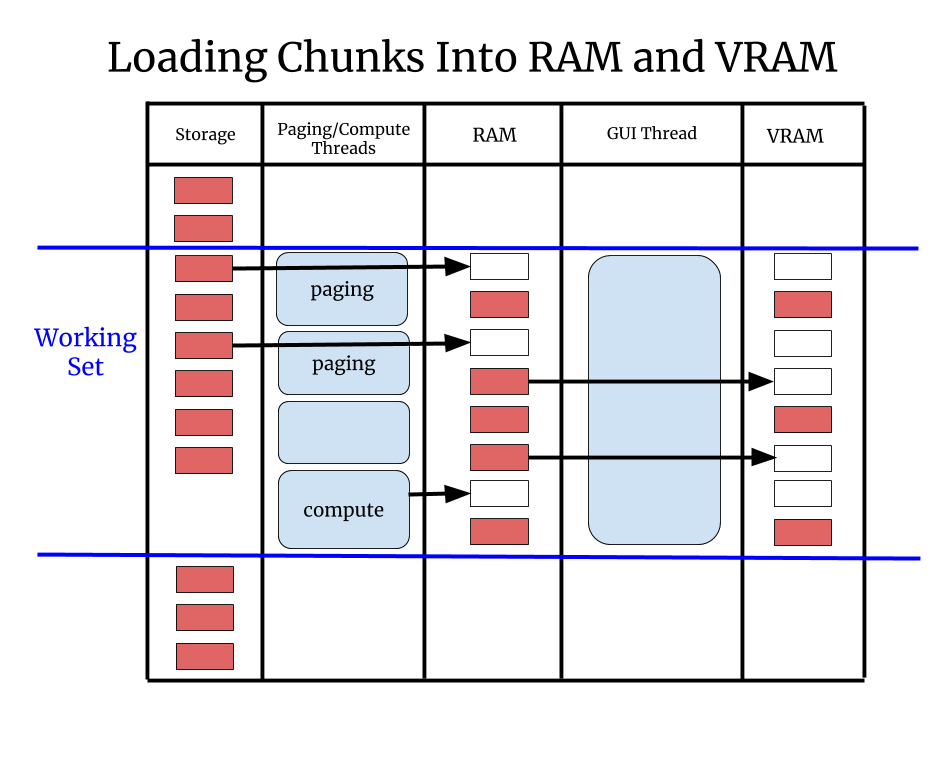
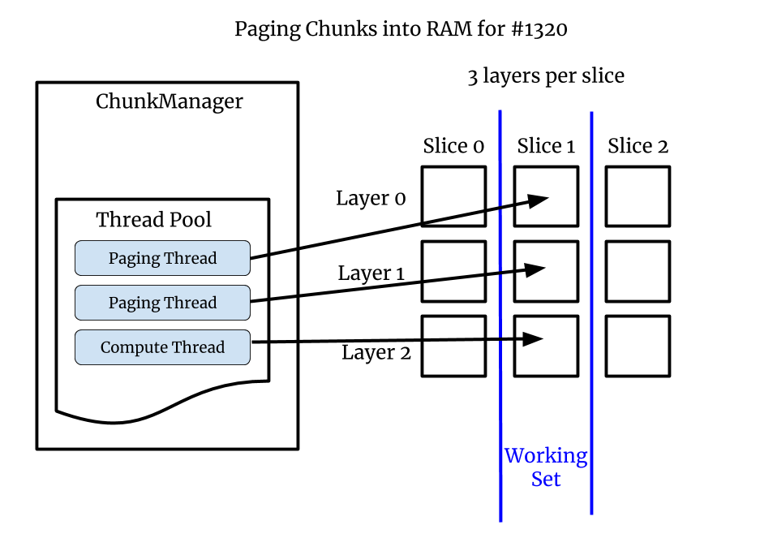
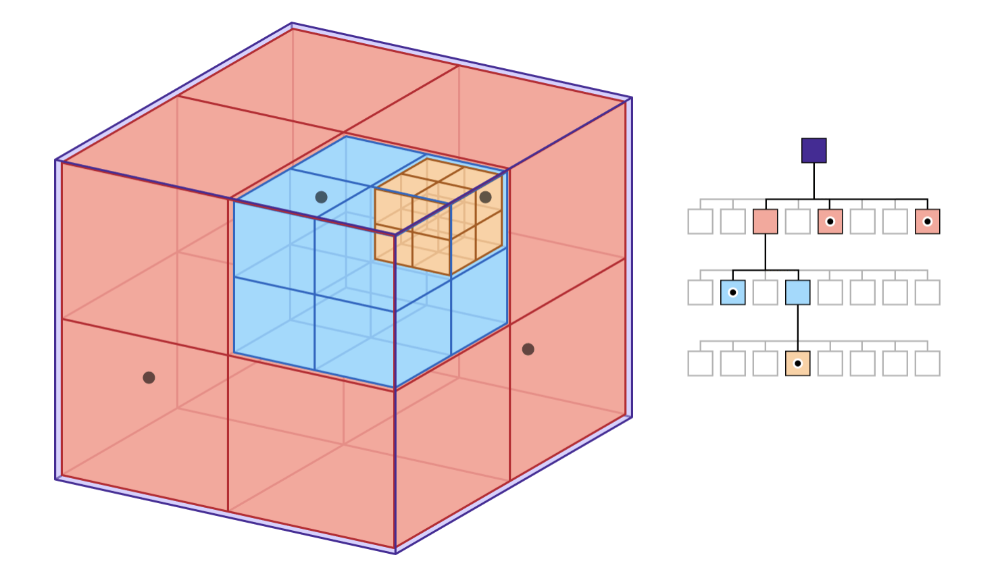

# Overview

This document outlines our plans for making napari's rendering non-blocking. We hope to morph this document from a plan into the details of the final design as implement things.

# Blocked UI

In May 2020 we looked into three issues related to blocked UI:

| Issue                                                 | Summary                                                        |
| ----------------------------------------------------- | -------------------------------------------------------------- |
| [#845](https://github.com/napari/napari/issues/845)   | UI blocked by Disk or Network IO rendering multi-scale images. |
| [#1300](https://github.com/napari/napari/issues/1300) | UI blocked rendering large in-memory images (not multi-scale). |
| [#1320](https://github.com/napari/napari/issues/1320) | UI blocked rendering small images due to lazy computations.    |

When the UI is "blocked" napari feels slow and lags. It's not just an aesthetic
issue, manipulation of interactive UI elements like sliders becomes nearly
impossible if the framerate is low enough. In the worst case if the GUI thread
is blocked a few seconds you can get the "spinning wheel of death" on Macs
indicating the application is hung, which makes napari seem totally broken.

Napari is very extensible and customizable and users can create what amounts to
custom applications built on top of napari. For example they can create custom
UI elements which manipulate parameters which generate new images on the fly. So
when the napari UI is blocked it's not just "image viewing" that's blocked,
their whole application becomes unusable.

 For all of these reasons we'd like napari's GUI thread to never block.

# Framerate

Most screens refresh at 60Hz. To look and feel fully responsive a GUI
application should strive to draw at 60Hz as well. If 60Hz is not possible,
however, refreshing as fast as possible is important because the user experience
degrades rapidly as the refresh rate gets slower:

| Framerate | Milliseconds | User Experience |
| --------- | ------------ | --------------- |
| 60Hz      | 16.7         | Great           |
| 30Hz      | 33.3         | Good            |
| 20Hz      | 50           | Acceptable      |
| 10Hz      | 100          | Bad             |
| 5Hz       | 200          | Unusable        |

In addition to the average rate dropping there can be single slow frames, or
patterns with slow and fast frames, this leads to "stuttering". These variations
in framerate should be minimized as well since they will make napari seem
glitchy or flakey even if the average framerate is decent.

# Array-like Interface

Napari renders data out of an "array-like" interface, which is any object that
presents an interface compatible with `numpy`'s slicing syntax. This is a
powerful abstraction because almost anything could present an array-like
interface. However this flexibility is a huge challenge for napari. Many "large
image viewers" are tightly integrated with a specific file format. In contrast
we'd like napari to work with basically any source of data.

With **Dask** or custom code it's possible an array access results in IO from
disk or the network. It's even possible the data does not exist at all and it
will be computed on-the-fly when it is accessed. In this case the user's code is
doing the computation and we have no control or visibility into what it's doing,
it could take a really long time.

In #845 the array access lead to loading data from disk or over the network. In
#1320 the array access leads to a Machine Learning (Torch) calculation. In #1300
the problem is different. There the data is already entirely in memory, but it's
not chunked. So today we transfer a single large array, 100's of MB, to the card
and this is slow. We can't have huge monolithic arrays of data in the system.

# Goals

This leads to two major design goals for rendering:

1. Always break data into "small" chunks.
2. Never call `asarray` on user data from the GUI thread since we don't know
   what it will do or how long it will take.

# Render Algorithm.

The render will interect the current view with the dataset to determine the
working set. The working set is the set of chunks that we want to draw for that
specific view. The renderer will step through every chunk in the working set and
do one of three things:

| Case                         | Action                                      |
| ---------------------------- | ------------------------------------------- |
| Chunk is in VRAM             | Render the chunk                            |
| Chunk is in RAM but not VRAM | If there is time transfer the chunk to VRAM |
| Chunk is not in RAM          | Ask the `ChunkManager` to load the chunk    |

This algorithm is why the GUI thread should never block. Not matter what is in memory or not in memory, the render should be very quick, hopefully less than 16.7ms so we can draw at 60Hz.

# Chunks

**Chunks** is a deliberately vague term. *A chunk is data used to render a
portion of the scene*. Without chunks we have only two choices: render nothing
or render the entire scene. With chunks we can partially and progressively
render the scene using whatever chunks are currently available. This very
valuable because often the user can navigate or make other decisions with
partially loaded data.

The most common types of chunks are blocks of contiguous memory inside a chunked
file format like **Zarr** (on disk) and exposed by an API like **Dask**. If an
image is stored without chunks then reading a 2D rectangle would require
hundreds of small read operations from all over the file. With chunks you can
read a rectangular region with a single read operation.

For 3D images the chunks tend to be 3D blocks, but the idea is the same.
Neuroglancer commonly stores the data in 64x64x64 voxel chunks which is 256KB.
This is useful because you can read the data in XY, XZ or YZ and it performs the
same in each orientation. It's also nice because you scroll through slices
quickly since on average you have 32 slices above and below your current
location.

In #1300 there are no chunks, the images were created in memory as one
monolithic thing, so we are going to have to break it into chunks in order to
send it to the graphics card incrementally. In #1320 the images are small so we
are not chunked, but there are 3 image layers, so we can consider the full
layers to be chunks. In general we can get creative with chunks, they can be
spatial subdivisions or any other division we want.

With non-image data like points, shapes and meshes we can have 2D or 3D spatial
chunks, we can have layers, and we can invent other sub-divisions to use as
chunks. *As long as things can be loaded and drawn independently we can use them
as chunks*.

# Loading into RAM and VRAM

There is a two step process to get data into VRAM where we can draw it. First it needs to be loaded into RAM and then transferred into VRAM.

Loading into RAM must be done in a thread since we don't know how long it will
take. For example loading data over the internet or doing a complex calculation
to produce the data could both take really long time. We are going to use the
new `@thread_worker` interface for our thread pool.

Loading into VRAM is a different story because it must happen in the GUI thread, at least that is our assumption while we are using OpenGL. Therefore we need to amortize the load over some number of frames. We will set a a budget, for example 5 milliseconds. Each frame can spend that much time loading data into VRAM, it will spend the rest of the frame drawing as normal. In this case it's important no single chunk takes more than 5 milliseconds to transfer, or that frame might be slow.

# Example: #1320

In #1320 the images are not chunked since they are very small, but there are 3
layers per slice, so these per-slice layers are our chunks. Some layers are
coming off disk some are computed. The "working set" is the set of chunks we
need to draw the full current scene. In this case we need the visible layers for
the current slice.

# Example: #845

In #845 we are drawing a multi-scale image which is chunked on disk.

## Chunk Size

It's confusing but there can be different chunk sizes in use at one time. With
**Dask** often Dask's chunks are larger than the file format's chunks. This
means loading one Dask chunk can cause many disk chunks to load into memory. We
might choose our rendering chunks to be the same size as Dask is using, if we
can even determine that, or we might chose a different size.

In the end there are two different types of speed, framerate and load time, and
sometimes there is a tradeoff. For example chunks that are really small might
have a great framerate but slow loading speed. In the worst case we might have
to let the user tune the chunk size.

## Octree

In #1320 our chunks were layers, so the ChunkManager can write data into those layers. With #845 chunks are spatial so we need a new spatial datastructure that can keep track of which chunks are in memory and store the per-chunk data.

We are doing to use an octree. See [Apple's](https://developer.apple.com/documentation/gameplaykit/gkoctree) depiction of an octree:

In a quadtree every node has 4 children that divides each square node into 4
parts: upper-left, upper-right, lower-left and lower-right. An octree is the
same thing in 3D: every node has up to 8 children, the 4 on top and the 4 on the
bottom. We can use our octree for 2D situations just by restricting ourselves to
the top 4 children.

## Multi-resolution

Like image pyramids the octree can store many versions of the same data at different resolutions. The root node contains a downsampled depiction of the entire dataset. As the user zooms in, we descend into child nodes which contain ever smaller portions of the data, but at a higher resolution.

In either case if a chunk is not in memory it will be requested from the
`ChunkManager`. Until the data is in memory the renderer needs to draw a
placeholder. In many cases the best placeholder will be from a different level
of the octree. This produces the common effect in larger image browsers where
the view is initially blurry and then "refines" as more data is loaded.

In the worst case if no stand-in is availabel the placeholder can be blank or a grid or a "loading" animation.

## Beyond Images

We are starting with 2D images but we are going to build the `ChunkManager` and octree in a generic way so that we can add in more layer types as we go, including 3D images, points, shapes and meshes. 2D images are the simplest case, but we believe most the infrastucture can be used by the they other layers times.

There are several reason the other layers types can be harder:

1. Downsampling images is fast and well understood but downsample geometry can be slow and complicated. There are many ways to "downsample" a 3D mesh it can get very complex with trade-offs for speed and quality.
2. Sometimes we will want downsample versions of things to look totally unlike the real data. For example instead of seeing millions of tiny points, the user might want to see heatmap indicating where the points are.
3. With images the data density is uniform but with geometry it can vary widely. You can pack in millions of points/shapes/triangles into a tiny area.

Luckily we don't need to solve all these problems to start. We can have a working octree for 2D and later 3D images before tackling the other layer types. We can render asymetrically where with an octree for the images but no spatial subdivision for the other types. Or we can have a simplistic downsampling algorithm to start that doesn't preserve visual quality but does render fast, and improve it over time.

## Implementation Plan

Follow the steps listed in [#1320](https://github.com/napari/napari/issues/1320) to fully resolve it first it:

1.  Create a `ChunkManager` class that uses a `@thread_worker` thread pool.
2.  Introduce a `DataSource` class that only optionally contains data.
3.  Paging thread puts data into `DataSource` and triggers a `draw()`.
4.  Morph `_set_view_slice` into a `draw()` routine.
    1.  Draws what it can, pages/loads what is to.
5.  Figure out how we set the size of the thread poo.
   
With #1320 resolved we need to create the octree infrastrcture to solve #845 and #1300. The steps are TBD but we do want to keep in general with the other image types in mind.

# Appendix

## Number of Workers

How many worker threads should we have? The problem is we don't know what is going on "under the hood". Some possible cases:

| Situation               | Optimal Number Of Threads                               |
| ----------------------- | ------------------------------------------------------- |
| Local IO                | Depends on the device and access patterns.              |
| Remote IO               | Potentially a large number to mask connection overhead. |
| Small Compute (1 core)  | We might want one thread per core.                      |
| Big Compute (all cores) | One thread only.                                        |

We might have to aim for "reasonable defaults which yield reasonable performance" and count on the user the configure napari (through GUI or API) to make things more optimal. Or some day we might get fancy and try to sense or infer that's going on and tune it ourselves.

## Threads or Processes

Hopefully we can stick with threads for parallelism. However in Python threads cannot run completely independently of each other due to the GIL. Luckily in many cases thread will release the GIL to do IO or compute-intensive operations, such that they can run independently. If there contention however we can paging and compute processes instead of threads. This has issue though especially running arbitrary user code, so it's something we'll address only if we have to.
