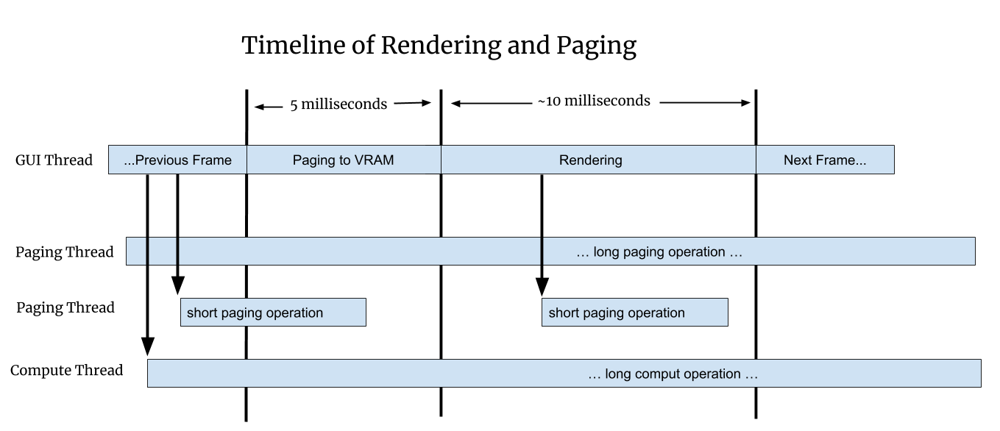

# Overview

This document outlines our plans for making napari's rendering non-blocking. We
hope to morph this document from a plan into the details of the final design as
we implement it.

# Blocked UI

In May 2020 we looked into three issues related to blocked UI:

| Issue                                                 | Summary                                                              |
| ----------------------------------------------------- | -------------------------------------------------------------------- |
| [#845](https://github.com/napari/napari/issues/845)   | UI blocked by Disk or Network IO while rendering multi-scale images. |
| [#1300](https://github.com/napari/napari/issues/1300) | UI blocked while rendering large in-memory images (not multi-scale). |
| [#1320](https://github.com/napari/napari/issues/1320) | UI blocked while rendering small images due to lazy computations.    |

When the UI is "blocked" napari feels slow and lags. It's not just an aesthetic
issue, manipulation of interactive UI elements like sliders becomes nearly
impossible if the framerate is low enough. In the worst case if the GUI thread
is blocked for a few seconds you can get the "spinning wheel of death" on Macs
indicating the application is hung, which makes napari seem totally broken.

Napari is very extensible and customizable and users can create what amounts to
custom applications built on top of napari. For example they can create custom
UI elements which manipulate parameters which generate new images on the fly. In
these cases when napari UI is blocked it's not just viewing images that's
blocked, their whole application is frozen and unusable.

 For all of these reasons a primary design goal for rendering is to make sure
 napari's GUI thread never blocks.

# Framerate

Most screens refresh at 60Hz. To look and feel fully responsive a GUI
application should strive to draw at 60Hz as well. If 60Hz cannot be acheived
rendering as fast as possible is desired. The user experience degrades rapidly
as the refresh rate gets slower:

| Framerate | Milliseconds | User Experience |
| --------- | ------------ | --------------- |
| 60Hz      | 16.7         | Great           |
| 30Hz      | 33.3         | Good            |
| 20Hz      | 50           | Acceptable      |
| 10Hz      | 100          | Bad             |
| 5Hz       | 200          | Unusable        |

Aside from the average framerate if napari renders even a single frame slowly or
has a pattern of slow and fast frames is can be annoying. People use the term
[janky](http://jankfree.org/) to describe applications that have framerate
irregularity. We want napari's average framerate to be high but we also want
a consistent framerate.

# Array-like Interface

Napari renders data out of an "array-like" interface. This means napari accepts
any object that can take `numpy`'s slicing syntax. This is a powerful
abstraction because almost anything could present this type of interface, but
the flexibility creates a huge challenge for napari since it needs to work with
basically any source of data.

With **Dask** or custom code it's possible an array access will result in disk
or network IO. It's even possible the data does not exist at all and it will be
computed on-the-fly. In this case the user's code is doing the computation and
napari has no control or visibility into the computation or how long it will
take.

In #845 the array access leads to loading data from disk or over the network. In
#1320 the array access leads to a machine learning calculation with Torch. In
#1300 the problem is different. There the data is already entirely in memory,
but it's not chunked. Today that means we transfer 100's of MB to the card in
one shot and this blocks the UI. We can't allow huge monolithic arrays of data
in napari. Everything must be broken down into reasonably sized chunks.

# Requirements

To met our goal of never blocking the UI we need to satisfy two requirements:

1. Always break data into chunks. The exact maximum chunk size is TBD.
2. Never call `asarray` on user data from the GUI thread since we don't know
   what it will do or how long it will take.

# Render Algorithm

The renderer will intersect the current view with the dataset to determine the
working set. The working set is the set of chunks that we need to draw to fully
render that specific view. The renderer will step through every chunk in the
working set and do one of three things:

| Case                         | Action                                      |
| ---------------------------- | ------------------------------------------- |
| Chunk is in VRAM             | Render the chunk                            |
| Chunk is in RAM but not VRAM | Transfer the chunk to VRAM if there is time |
| Chunk is not in RAM          | Ask the `ChunkManager` to load the chunk    |

If a chunk cannot be drawn a placeholder will be drawn instead. What we draw as
a placeholder is TBD and it may vary. In some cases we might be able to draw a
lower resolution version of the data, which can be refined later as more data is
available. In the worst case we might have to draw a blank grid or a loading
animation.

# Chunks

**Chunks** is a deliberately vague term. *A chunk is data used to render a
portion of the scene*. Without chunks we have only two choices: render nothing
or render the entire scene. With chunks we can partially render the scene using
whatever chunks are currently available, and we can progressively add more and
more chunks as more data is loaded.

Progressive rendering is valuable because the user can often navigate or make
other decisions with partially loaded data, so the user can work faster. Also
progressive rendering just feels more pleasant for the user. Progressive rending
makes the internal state of the application visible which is often leads to a
better user experience.

## Chunked File Formats

The most common types of chunks are blocks of contiguous memory inside a chunked
file format like **Zarr** and exposed by an API like **Dask**. If an
image is stored without chunks then reading a 2D rectangle would require
hundreds of small read operations from all over the file. With chunks you can
read a rectangular region with a single read operation.

For 3D images the chunks tend to be 3D blocks, but the idea is the same.
Neuroglancer commonly stores the data in 64x64x64 voxel chunks which is 0.25MB
per chunk. This is useful because you can read the data in XY, XZ or YZ and it
performs the same in each orientation. It's also nice because you scroll through
slices quickly since on average you have 32 slices above and below your current
location.

## Creating Chunks

In #1300 there are no chunks, the images were created in memory as one
monolithic array. So to solve #1300 we are going to have to break that array
into chunks in order to send it to the graphics card incrementally. In #1320 the
images are small so we are not chunked, but there are 3 image layers, so we can
consider the full layers to be chunks. In general we can get creative with
chunks, they can be spatial subdivisions or any other division we want.

With non-image data like points, shapes and meshes we can have 2D or 3D spatial
chunks, we can have layers, and we can invent other sub-divisions to use as
chunks. *As long as things can be loaded and drawn independently we can use them
as chunks*.

# Loading into RAM and VRAM

There is a two step process to get data into VRAM where we can draw it. First it
needs to be loaded into RAM and then transferred into VRAM.

Loading into RAM must be done in a thread since we don't know how long it will
take. For example loading data over the internet or doing a complex calculation
to produce the data could both take really long time. We are going to use the
new `@thread_worker` interface for our thread pool.

Loading into VRAM is a different story because it must happen in the GUI thread,
at least that is our assumption while we are using OpenGL. Therefore we need to
amortize the load over some number of frames. We will set a budget, for
example 5 milliseconds. Each frame can spend that much time loading data into
VRAM, it will spend the rest of the frame drawing as normal. In this case it's
important that no single chunk takes more than 5 milliseconds to transfer.

Viewed as a timeline the rendering thread render regularly spaced frames while
in parallel IO and compute threads load data into RAM.

# Example: #1320

In #1320 the images are not chunked since they are very small, but there are 3
layers per slice, so these per-slice layers are our chunks. Some layers are
coming off disk some are computed. The "working set" is the set of chunks we
need to draw the full current scene. In this case we need the visible layers for
the current slice.

# Example: #845

In #845 we are drawing a multi-scale image which is chunked on disk.

## Chunk Size

It's confusing but there can be different chunk sizes in use at one time. If
using **Dask** it's chunks are often larger than the file format's chunks. This
means loading one Dask chunk can cause many disk chunks to load into memory. We
might choose our rendering chunks to be the same size as Dask is using, if we
can even determine that, or we might chose a different size.

In the end there are two different types of speed: framerate and load time.
Sometimes there is a tradeoff and we can speed up loading by slowing the
framerate a bit. Hopefully we can come up with defaults that work well for most
people, but we'll probably need to provide a way for the user to tune the chunks
if necessary.

## Octree

To solve #1320 our chunks will be layers. The ChunkManager can write the data
into the `Image` object for those layers. However with #845 chunks are spatial
so we need a new spatial datastructure that can keep track of which chunks are
in memory and store the per-chunk data.

We are doing to use an octree. See
[Apple's](https://developer.apple.com/documentation/gameplaykit/gkoctree) nice
illustration of an octree:

In a quadtree every square node is divided into 4 children representing the 4
spatial quadrants of that node: upper-left, upper-right, lower-left and
lower-right. An octree is the same idea but in 3D: every node has up to 8 children,
the 4 on top and the 4 on the bottom.

We can use our octree for 2D situations just by restricting ourselves to the top
4 children. So we plan to always use the same octree datastructure all the time,
but use it in 2D or 3D modes as needed.

## Multi-resolution

Like image pyramids the octree can store many versions of the same data at
different resolutions. The root node contains a downsampled depiction of the
entire dataset. As the user zooms in, we descend into child nodes which contain
ever smaller portions of the data, but at ever higher resolutions.

In either case if a chunk is not in memory it will be requested from the
`ChunkManager`. Until the data is in memory the renderer will draw a
placeholder. In many cases the best placeholder will be from a different level
of the octree. This will produce the often seen effect where the image is
initially blurry but then "refines" as more data is loaded. In the worst case if
no stand-in is available the placeholder can be blank or a grid potentially with
a "loading" animation.

## Beyond Images

We are starting with 2D images but we are going to build the `ChunkManager` and
octree in a generic way so that we can add in more layer types as we go,
including 3D images, points, shapes and meshes. 2D images are the simplest case,
but we believe most the infrastructure can be used by the they other layers
times.

There are several reason the other layers types can be harder:

1. Downsampling images is fast and well understood but downsample geometry can
   be slow and complicated. There are many ways to "downsample" a 3D mesh it can
   get very complex with trade-offs for speed and quality.
2. Sometimes we will want downsample versions of things to look totally unlike
   the real data. For example instead of seeing millions of tiny points, the
   user might want to see heatmap indicating where the points are.
3. With images the data density is uniform but with geometry it can vary widely. You can pack in millions of points/shapes/triangles into a tiny area.

Luckily we don't need to solve all these problems to start. We can have a
working octree for 2D and later 3D images before tackling the other layer types.
We can render asymmetrically where with an octree for the images but no spatial
subdivision for the other types. Or we can have a simplistic downsampling
algorithm to start that doesn't preserve visual quality but does render fast,
and improve it over time.

## Implementation Plan

We will resolve [#1320](https://github.com/napari/napari/issues/1320) first:

1.  Create a `ChunkManager` class that uses a `@thread_worker` thread pool.
2.  Introduce a `DataSource` class that only optionally contains data.
3.  Paging thread puts data into `DataSource` and triggers a `draw()`.
4.  Morph `_set_view_slice` into a `draw()` routine.
    1.  Draws what it can, pages/loads what is to.
5.  Figure out how we set the size of the thread pool.

See the issue comments for more details.
   
With #1320 resolved we need to create the octree infrastructure to solve #845
and #1300. The steps are TBD but we do want to keep in general with the other
image types in mind.

# Appendix

## Number of Workers

How many worker threads should we have? The challenge is we don't know what is
going on behind the array-like interface. Some possible situations:

| What The Worker Is Doing | Optimal Number Of Threads                      |
| ------------------------ | ---------------------------------------------- |
| Local IO                 | Depends on the device and the access patterns. |
| Remote IO                | A large number since setup costs are large.    |
| Small Compute (1 core)   | One thread per available core.                 |
| Big Compute (all cores)  | One thread total.                              |

We might have to aim for "reasonable defaults which yield reasonable
performance". This should keep rendering non-blocking and fast even if
load/compute is not optimal. We may have to allow the user to configure the
number of threads manually for the very best performance, either through the GUI
or through an API. People writing custom applications with napari will probably
not mind doing a bit of manual tuning and configuration to get the best
performance. 

Some day we could try to infer what's going on and adjust things dynamically
ourselves. For example we could detect if the CPU was underused and add more
threads.

## Threads, Processes and `asyncio`

Hopefully we can stick with threads for parallelism. However in Python threads
cannot run completely independently of each other due to the [Global Interpreter
Lock
(GIL)](https://medium.com/python-features/pythons-gil-a-hurdle-to-multithreaded-program-d04ad9c1a63).
Luckily in many cases a thread will release the GIL to do IO or
compute-intensive operations. During those spans of time the threads *can* run
independently.

The GIL only applies to threads that are actively running Python bytecode. Only
one thread can be executing bytecode at a time. The GIL makes Python threads
safer to use than threads in many languages. In Python two threads can in many
cases access the same datastructure without a lock because the GIL serves as
kind of a universal lock.

If we cannot get the performance we want using threads we might consider
switching to processes in some cases. Process ofter total isolation, but
processes do not share memory, so you have to explicitly pass data between
processes.

In the other direction Python contains asynchronous mechanisms such as
`asyncio`. These generally provide concurrency without parallelism. You can have
N tasks in progress, but they are all running interleaved in the same thread.
The advantage of this is these concurrent tasks are *much* lighter weight than
threads. In some languages you can have millions of concurrent tasks, not sure
about Python. `asyncio` is relatively new and we should keep it in mind for
rendering and other purposes.

## VRAM and Vispy

With OpenGL you cannot directly manage VRAM. Instead we will control what's in
VRAM by creating and drawing vispy objects. By drawing objects in our working
set VRAM should very quickly align to what we want it to contain.

To hit our ~5ms budget for paging into VRAM we just have to limit the number of
new vispy objects we create each frame. The goal is to have regularly spaced
frames and load in chunks over time, rather than have one super long frame where
all the chunks get loaded.

It's TBD exactly how we will use vispy, especially with the octree, but once we
have a concrete design we will revise this document.
