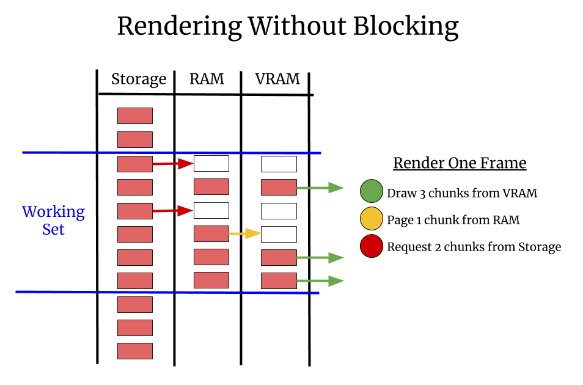

# Background

In May 2020 we looked into three issues related to the UI becoming blocked:

| Issue | Summary                                                        |
| ----- | -------------------------------------------------------------- |
| #845  | UI blocked by Disk or Network IO rendering multi-scale images. |
| #1300 | UI blocked rendering large in-memory images (not multi-scale). |
| #1320 | UI blocked rendering small images due to lazy computations.    |

When the UI is "blocked" napari feels slow and lags. It's not just an aesthetic
issue, manipulation of interactive UI elements like sliders becomes nearly
impossible if the framerate is low enough. If the GUI thread is blocked for long
enough you can get the "spinning wheel of death" on Macs indicating the
application is hung, which makes napari seem totally broken.

If napari is being used as the basis for a custom application, it's not just
image viewing that's blocked, the user's entire custom application is
essentially unusable. For all of these reasons we'd like napari's GUI thread to
never block.

# Framerate

Most screens refresh at 60Hz. To look and feel fully responsive a GUI
application should strive to draw at 60Hz as well. If 60Hz is not possible,
refreshing as fast as possible is desirable because the user experience degrades
rapidly as the refresh rate gets slower:

| Framerate | Milliseconds | User Experience |
| --------- | ------------ | --------------- |
| 60Hz      | 16.7         | Great           |
| 30Hz      | 33.3         | Good            |
| 20Hz      | 50           | Acceptable      |
| 10Hz      | 100          | Bad             |
| 5Hz       | 200          | Unusable        |

# The Problem

It's been a design goal that napari does not know very much about the data it's
rendering. It receives a `numpy` compatible "array like" interface and can
request whatever regions of data it needs.

In #845 and #1320 the problem is using `dask` or custom code when napari calls
`asarray` it might execute arbitrary code. In #845 the code contains disk or
networked IO operations which potentially take a long time. In #1320 the code
performance a computation for the user.

In #1300 the problem is different. In that case the data is 100% in memory and
ready to go. The problem is this is not a multi-image, it's a single large
image. And sending all that data to the card in one shot is slow. Even though
the data isn't chunked, we need to create chunks and send them over a few at a
time.

# The Rules

The solution to these 3 problems is following two rules:

1. Always break data into small "chunks" to send to the card.
2. Never call `asarray` on user data from the GUI thread.

# Chunks

| Step   | Action |
| ------ | ------ |
| Need d |
d

Going forward where the GUI thread used to call `asarray` we need it to request
that chunk gets paged in by some asynchronous mechanism such as a worker thread.
The worker thread will call `asarray` which might trigger IO or a computation in
that worker thread.

The dataset needs to be divided up spatially somehow. These could be 3d chunks
or 2d tiles or buckets or lists or some other unit of division. We cannot render
an opaque monolithic dataset.

When it is rendering the GUI thread needs figure out what portion of the data
needs to be rendered, generally what is visible on screen. This is the "working
set", it's part of the dataset we want to render.

As we iterate though the chunk in the working set we make one of 3 decisions:

1. The resources for this chunk are on the card, so we render the chunk.
2. The resources for this chunk are in RAM, but not on the card. We spend a
   bounded amount of time each thread moving chunks into VRAM, say 5ms per frame.
3. The resources for this piece are not in RAM, we request that a paging thread
   page the data into RAM.

