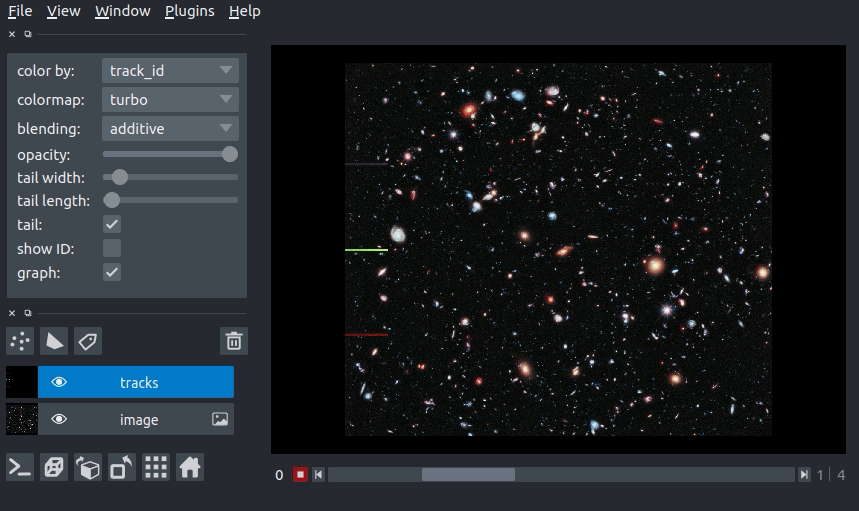
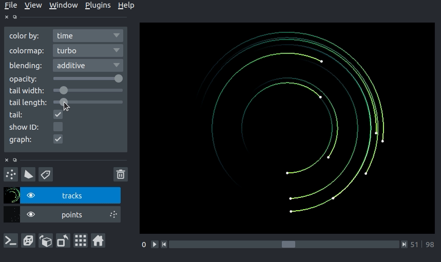
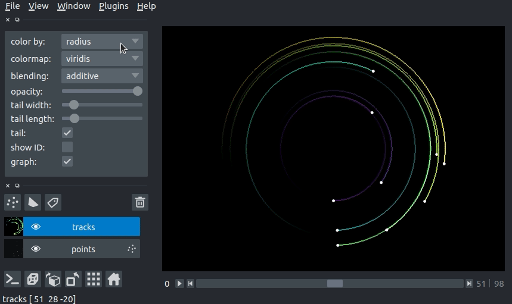
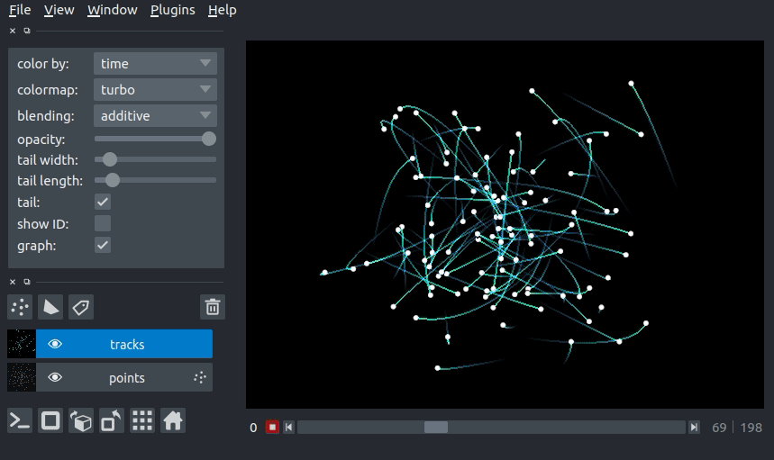

# tracks layer tutorial

Welcome to the tutorial on the **napari** `Tracks` layer! Please note that `Tracks` layer is a new layer type that will be released in `napari 0.4.0`, but it is available for preview on the [master branch](https://github.com/napari/napari).

This tutorial assumes you have already installed **napari**,
know how to launch the viewer,
and are familiar with its layout.
For help with installation see our [installation](./installation) tutorial.
For help getting started with the viewer see our [getting started](./getting_started) tutorial.
For help understanding the organisation of the viewer,
including things like the layers list,
the layer properties widgets,
the layer control panels,
and the dimension sliders
see our [napari viewer](./viewer) tutorial.

This tutorial will teach you about the **napari** `Tracks` layer,
including displaying tracks and defining relationships between tracks.

The tracks layer allows you to display trajectories in nD + t while visualizing the recent history of the track via a fading tail.

Each track can have annotations associated with it using the `Tracks.properties` dictionary.
These properties can be used to set the colors of the tracks.

For example, when displaying tracks of different classes/types,
one could automatically set color the individual tracks by their respective class/type.

## a simple example

You can create a new viewer and add a set of tracks in one go using the `napari.view_tracks` method,
or if you already have an existing viewer,
you can add tracks to it using `viewer.add_tracks`.
The api of both methods is the same.

In this example of we will overlay some tracks on an image from the Hubble space telescope:

```python
import napari
from skimage import data

hubble_image = data.hubble_deep_field()

tracks_data = [
    [1, 0, 236, 0],
    [1, 1, 236, 100],
    [1, 2, 236, 200],
    [1, 3, 236, 500],
    [1, 4, 236, 1000],
    [2, 0, 436, 0],
    [2, 1, 436, 100],
    [2, 2, 436, 200],
    [2, 3, 436, 500],
    [2, 4, 436, 1000],
    [3, 0, 636, 0],
    [3, 1, 636, 100],
    [3, 2, 636, 200],
    [3, 3, 636, 500],
    [3, 4, 636, 1000]
]

viewer = napari.view_image(hubble_image, name='image')
viewer.add_tracks(tracks_data, name='tracks')

napari.run()
```



## arguments of view_tracks and add_tracks

Both `view_tracks` and `add_tracks` have the following doc strings:

```python
"""
Parameters
----------
data : array (N, D+1)
    Coordinates for N points in D+1 dimensions. ID,T,(Z),Y,X. The first
    axis is the integer ID of the track. D is either 3 or 4 for planar
    or volumetric timeseries respectively.
properties : dict {str: array (N,)}, DataFrame
    Properties for each point. Each property should be an array of length N,
    where N is the number of points.
graph : dict {int: list}
    Graph representing associations between tracks. Dictionary defines the
    mapping between a track ID and the parents of the track. This can be
    one (the track has one parent, and the parent has >=1 child) in the
    case of track splitting, or more than one (the track has multiple
    parents, but only one child) in the case of track merging.
    See examples/tracks_3d_with_graph.py
color_by: str
    Track property (from property keys) by which to color vertices.
tail_width : float
    Width of the track tails in pixels.
tail_length : float
    Length of the track tails in units of time.
colormap : str
    Default colormap to use to set vertex colors. Specialized colormaps,
    relating to specified properties can be passed to the layer via
    colormaps_dict.
colormaps_dict : dict {str: napari.utils.Colormap}
    Optional dictionary mapping each property to a colormap for that
    property. This allows each property to be assigned a specific colormap,
    rather than having a global colormap for everything.
name : str
    Name of the layer.
metadata : dict
    Layer metadata.
scale : tuple of float
    Scale factors for the layer.
translate : tuple of float
    Translation values for the layer.
opacity : float
    Opacity of the layer visual, between 0.0 and 1.0.
blending : str
    One of a list of preset blending modes that determines how RGB and
    alpha values of the layer visual get mixed. Allowed values are
    {'opaque', 'translucent', and 'additive'}.
visible : bool
    Whether the layer visual is currently being displayed.

Returns
-------
layer : napari.layers.Tracks
    The newly-created tracks layer.
"""
```

## tracks data

The input data to the tracks layer must be an NxD+1 numpy array or list containing the coordinates of N vertices with a track ID and coordinate in D dimensions. The ordering of these dimensions is the same as the ordering of the dimensions for image layers.
This array is always accessible through the `layer.data` property
and will grow or shrink as new tracks are either added or deleted.

Consider the set of 4D tracks data (time + 3 spatial dimensions) defined below. The `Tracks` layer assumes the first column is the `track_id`, the second column is the time axis, and columns 3-5 are Z, Y, and X, respectively. Each row is one vertex in a track. All vertices with the same `track_id` are joined into a single track. In this case, we have defined 2 tracks: track 0, which goes from [10, 10, 10] to [20, 10, 10] and track 1, which goes from [10, 8, 5] to [7, 8, 10] (coordinates written as [x, y z]\).

| track_id | t | z  | y  | x  |
|----------|---|----|----|----|
| 0        | 0 | 10 | 10 | 10 |
| 0        | 1 | 10 | 10 | 20 |
| 1        | 0 | 5  | 8  | 10 |
| 1        | 1 | 10 | 8  | 7  |

The data in the array must be sorted by increasing `track_id` then time, as shown above.  We can pass the example data above to the tracks layer as follows:

```python

tracks_data = [
    [0, 0, 10, 10, 10],
    [0, 1, 10, 10, 20],
    [1, 0, 5, 8, 10],
    [1, 1, 10, 8, 7]
]

viewer = napari.view_tracks(tracks_data)
napari.run()
```


## tracks graph

We can use the tracks `graph` argument to define the relationships between tracks (e.g., tracks merging or tracks splitting). The graph is defined as a dictionary where the keys are the `track_id` and the values are the `track_id` of the parents of the the key.

For example, if we have a track 0, which splits into tracks 1 and 2 (i.e., track 0 is the parent of tracks 1 and 2), we would define the graph as:

```python
graph = {
    1: [0],
    2: [0]
}
```
If later tracks 1 and 2 merge into track 3 (i.e,. tracks 1 and 2 are the parent of track 3), the dictionary would become

```python
graph = {
    1: [0],
    2: [0],
    3: [1, 2]
}
```
For a full example of 3d+t tracks data with a parent graph, please see our [`tracks_3d_with_graph.py` example](https://github.com/napari/napari/blob/master/examples/tracks_3d_with_graph.py).

## using the tracks properties dictionary

The `Tracks` layer can contain properties that annotate the vertices of each track.
`Tracks.properties` stores the properties in a dictionary
where each key is the name of the property
and the values are numpy arrays with a value for each vertex in the track (i.e., length N for N vertices in `Tracks.data`).
As we will see below, we can use the values in a property to set the display properties of the tracks (e.g., the track color).


## 3D rendering of tracks

All our layers can be rendered in both 2D and 3D mode,
and one of our viewer buttons can toggle between each mode.
The number of dimensions sliders will be 2 or 3 less than the total number of dimensions of the layer.

## changing track width
We can specify the width of the tracks in pixels. The track width can be specified via the `tail_width` keyword argument in the `viewer.add_tracks()` and `napari.view_tracks()` methods. From a layer that as already been constructed, we can set the track width via the `layer.tail_width` property.

```python
# create a tracks layer with a tail width of 5 pixels
viewer = napari.view_tracks(data, tail_width=5, name="my_tracks")

# update the tail width to 3 pixels
viewer.layers["my_tracks"].tail_width = 3

```

Additionally, we can adjust the width of the track in the GUI using the "tail width" slider in the Tracks layer controls.


## changing tail length
We can specify the length of the tails of the tracks in time units. The tail is the portion of the track displayed from previous time steps. The track tail length can be specified via the `tail_length ` keyword argument in the `viewer.add_tracks()` and `napari.view_tracks()` methods. From a layer that as already been constructed, we can set the track width via the `tail_length ` property.

```python
# create a tracks layer with a tail length of 5 time units
viewer = napari.view_tracks(data, tail_length=5, name="my_tracks")

# update the tail width to 3 pixels
viewer.layers["my_tracks"].tail_length = 3

```

Additionally, we can adjust the width of the track in the GUI using the "tail length" slider in the Tracks layer controls.



## setting the track color with properties
We can color the tracks by mapping colors to the track properties defined in `Tracks.properties`. If we define properties and pass them via the properties keyword argument in the `viewer.add_tracks()` and `napari.view_tracks()` methods, we can then select the property we would like to color the tracks by in the "color by" dropdown menu in the `Tracks` layer controls. We can additionally specify the colormap used to map the property value to color via the "colormap" dropdown menu.

```python
import napari
from skimage import data

hubble_image = data.hubble_deep_field()

tracks_data = np.asarray([
    [1, 0, 236, 0],
    [1, 1, 236, 100],
    [1, 2, 236, 200],
    [1, 3, 236, 500],
    [1, 4, 236, 1000],
    [2, 0, 436, 0],
    [2, 1, 436, 100],
    [2, 2, 436, 200],
    [2, 3, 436, 500],
    [2, 4, 436, 1000],
    [3, 0, 636, 0],
    [3, 1, 636, 100],
    [3, 2, 636, 200],
    [3, 3, 636, 500],
    [3, 4, 636, 1000]
])
track_confidence = np.array(5*[0.9] + 5*[0.3] + 5 * [0.1])
properties = {
    'time': tracks_data[:, 1],
    'confidence': track_confidence
}

viewer = napari.view_image(hubble_image)
viewer.add_tracks(tracks_data, properties=properties)
napari.run()
```



## layer visibility

All our layers support a visibility toggle that allows you to set the `visible` property of each layer.
This property is located inside the layer widget in the layers list and is represented by an eye icon.

## layer opacity

All our layers support an opacity slider and `opacity` property
that allow you to adjust the layer opacity between 0, fully invisible, and 1, fully visible.
The opacity value applies globally to all the tracks in the layer.

## blending layers

All our layers support three blending modes `translucent`, `additive`, and `opaque`
that determine how the visuals for this layer get mixed with the visuals from the other layers.

An `opaque` layer renders all the other layers below it invisible
and will fade to black as you decrease its opacity.

The `translucent` setting will cause the layer to blend with the layers below it if you decrease its opacity
but will fully block those layers if its opacity is 1.
This is a reasonable default, useful for many applications.

The final blending mode `additive` will cause the layer to blend with the layers below even when it has full opacity.
This mode is especially useful for visualizing multiple layers at the same time.

## naming layers

All our layers support a `name` property that can be set inside a text box inside the layer widget in the layers list.
The name of each layer is forced into being unique
so that you can use the name to index into `viewer.layers` to retrieve the layer object.

## scaling layers

All our layers support a `scale` property and keyword argument
that will rescale the layer multiplicatively according to the scale values (one for each dimension).
This property can be particularly useful for viewing anisotropic data
where the size of the voxel in the z dimension might be different then the size in the x and y dimensions.

## translating layers

All our layers support a `translate` property and keyword argument
that you can use to offset a layer relative to the other layers,
which could be useful if you are trying to overlay two layers for image registration purposes.

## layer metadata

All our layers also support a `metadata` property and keyword argument
that you can use to store an arbitrary metadata dictionary on the layer.

## putting it all together

Here you can see an example of 3D+t tracks. You can view the source code for this example [here](https://github.com/napari/napari/blob/master/examples/tracks_3d.py)



## next steps

Hopefully, this tutorial has given you a detailed understanding of the `Tracks` layer,
including how to create one and control its properties.
To learn more about some of the other layer types that **napari** supports
checkout some more of our tutorials listed below.
