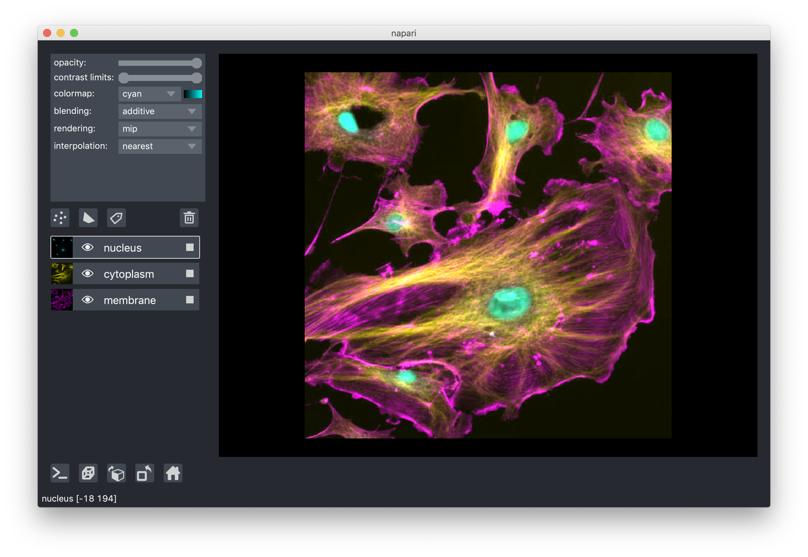

# Layers at a glance

[Layers](napari.layers) are the basic viewable objects that can be added to a
viewer. **napari** supports seven main different layer types: `Image`, `Labels`,
`Points`, `Shapes`, `Surface`, `Tracks` and `Vectors`. Each of the layer types
corresponds to a different data type, visualization, and interactivity. You can
add multiple layers of different types into the viewer and then start working
with them, adjusting their properties.

All our layer types support n-dimensional data and the viewer provides the
ability to quickly browse and visualize either 2D or 3D slices of the data.

After creating a {class}`napari.Viewer` object, each layer for this object can
be created by a corresponding `viewer.add_<layer>` method. For example, to add
an {class}`Image layer <napari.layers.Image>` named `astronaut` to the `viewer`
object created from `data`, you can do

```python
viewer = napari.Viewer()
viewer.add_image(data, name='astronaut')
```

To learn more about the layers available, see the
[Layers documentation](napari.layers). To learn about how to use the layers currently supported by napari, check out the
[Using layers how-to guides](../../howtos/layers/index). For a gentle
introduction, check out the
[Layer list section in the napari viewer tutorial](layer_list).

## Layer visibility

All our layers support a visibility toggle that allows you to set the `visible`
property of each layer. This property is located inside the layer widget in the
layers list and is represented by an eye icon.

(layer_opacity)=
## Layer opacity

All our layers support an opacity slider and `opacity` property that allow you
to adjust the layer opacity between 0, fully invisible and 1, fully visible.

```{note}
* For the [points layer](napari.layers.Points), the opacity value applies
globally to all the points in the layer, and so you don't need to have any
points selected for it to have an effect.
* For the [shapes layer](napari.layers.Shapes), the opacity value applies
globally to all shapes in the layer, and so you don't need to have any
shape selected for it to have an effect.
* For the [vectors layer](napari.layers.Vectors), the opacity value applies
globally to all the vectors in the layer.
* For the [tracks layer](napari.layers.Tracks), the opacity value applies globally to all the tracks in the layer.
```

## Blending layers

All our layers support three blending modes: `translucent`, `additive`, and
`opaque`. These modes determine how the visuals for this layer get mixed with
the visuals from the other layers.

* An `opaque` layer hides any layer data below it.
* A `translucent` setting will cause the layer to blend with the layers below
it if you decrease its opacity but will fully block those layers if its opacity
is `1`. This is a reasonable default, useful for many applications.
* A `minimum` blending mode will cause the layer to blend using the minimum of each pixel's R, G, and B values. This mode is uniquely useful for
blending multiple layers with inverted colormaps/LUTs, which represent measured signal with color on a white background. For some inspiration, see the twitter hashtag [#invertedLUT](https://twitter.com/hashtag/invertedLUT).
* An `additive` blending mode will cause the layer to blend with the layers
below even when it has full opacity. This mode is especially useful for
visualizing multiple layers at the same time, such as cell biology applications
where you have multiple different components of a cell labeled in different
colors.

For example:



## 3D rendering of images

All our layers can be rendered in both 2D and 3D mode, and one of our viewer
buttons can toggle between each mode. The number of dimensions sliders will be 2
or 3 less than the total number of dimensions of the layer, allowing you to
browse volumetric timeseries data and other high dimensional data. See for
example these cells undergoing mitosis in this volumetric timeseries:


```{note}
Switching to 3D mode for a very large data set could trigger computation that
leads to a memory error.
```

## Layer interpolation

We support a variety of interpolation modes when viewing 2D slices. In the
default mode `nearest` each pixel is represented as a small square of specified
size. As you zoom in you will eventually see each pixel. In other modes
neighbouring pixels are blended together according to different functions, for
example `bicubic`, which can lead to smoother looking images. For most
scientific use cases, `nearest` is recommended because it displays each data
point, with no mixing of nearby data points. These modes have no effect when
viewing 3D slices.

## Layer rendering

When viewing 3D slices, we support a variety of rendering modes. The default
mode `mip`, or maximum intensity projection, will combine voxels at different
distances from the camera according to a maximum intensity projection to create
the 2D image that is then displayed on the screen. This mode works well for many
biological images such as these cells growing in culture:


When viewing 2D slices the rendering mode has no effect.

## Naming layers

All our layers support a `name` property that can be set inside a text box
inside the layer widget in the layers list. The name of each layer is forced
into being unique so that you can use the name to index into `viewer.layers` to
retrieve the layer object.

## Scaling layers

All our layers support a `scale` property and keyword argument that will rescale
the layer multiplicatively according to the scale values (one for each
dimension). This property can be particularly useful for viewing anisotropic
volumes where the size of the voxel in the z dimension might be different then
the size in the x and y dimensions.

In napari, you can scale the layers when creating an image layer or for an
existing layer using the `scale` as a keyword argument or property respectively.

```python
# scaling while creating the image layer
napari.view_image(retina, name='retina', scale=[1,10,1,1])
# scaling an existing layer
viewer.layers['retina'].scale = [1,10,1,1]
```


## Translating layers

All our layers support a `translate` property and keyword argument that you can
use to offset a layer relative to the other layers, which could be useful if you
are trying to overlay two image tiles acquired with different stage positions.

## Layer metadata

All our layers also support a `metadata` property and keyword argument that you
can use to store an arbitrary metadata dictionary on the layer.
