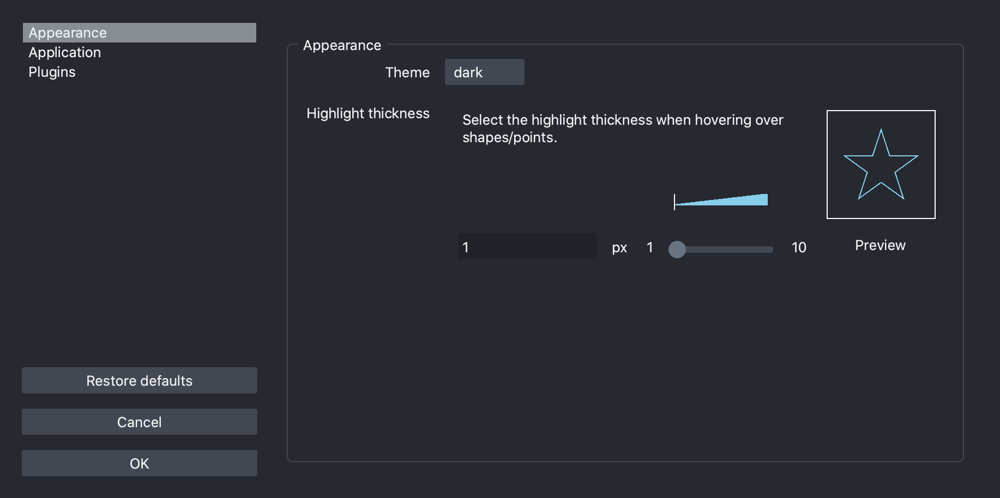
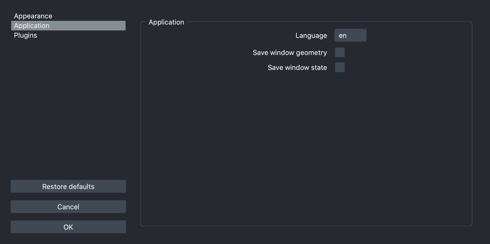
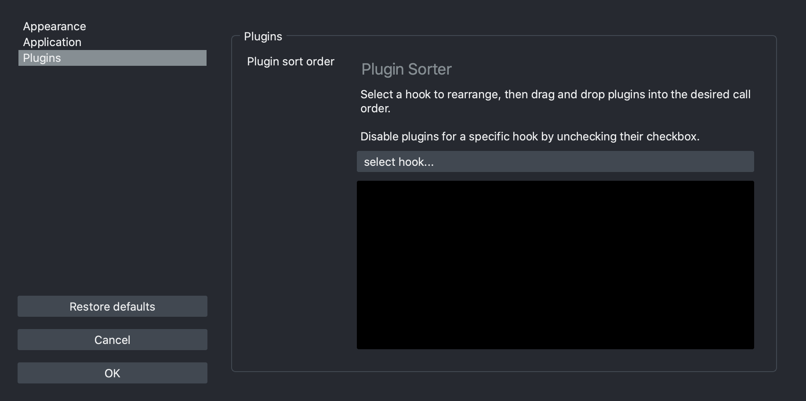
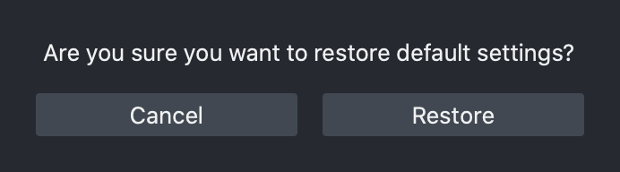

(preferences)=

# Preferences

Starting with version 0.4.6, napari provides persistent settings.

Settings are managed by the global `SETTINGS` object and can be imported as:

```python
from napari.utils.settings import SETTINGS
```

## Sections

The settings are grouped by sections and napari core provides the following:

### Appearance

User interface appearance settings.


#### Highlight thickness

Select the highlight thickness when hovering over shapes/points.

* Access programmatically with `SETTINGS.appearance.highlight_thickness`.
* Type: `<class 'napari.utils.events.evented_model.ConstrainedIntValue'>`.
* Default: `1`.
* UI: This setting can be configured via the preferences dialog.
#### Theme

Select the user interface theme.

* Access programmatically with `SETTINGS.appearance.theme`.
* Type: `<class 'napari.utils.settings._defaults.Theme'>`.
* Default: `'dark'`.
* UI: This setting can be configured via the preferences dialog.

### Application

Main application settings.


#### Console notification level

Select the notification level for the console.

* Access programmatically with `SETTINGS.application.console_notification_level`.
* Type: `<enum 'NotificationSeverity'>`.
* Default: `<NotificationSeverity.NONE: 'none'>`.

#### First time

Indicate if napari is running for the first time. This setting is managed by the application.

* Access programmatically with `SETTINGS.application.first_time`.
* Type: `<class 'bool'>`.
* Default: `True`.

#### GUI notification level

Select the notification level for the user interface.

* Access programmatically with `SETTINGS.application.gui_notification_level`.
* Type: `<enum 'NotificationSeverity'>`.
* Default: `<NotificationSeverity.INFO: 'info'>`.

#### IPython interactive

Toggle the use of interactive `%gui qt` event loop when creating napari Viewers in IPython.

* Access programmatically with `SETTINGS.application.ipy_interactive`.
* Type: `<class 'bool'>`.
* Default: `True`.

#### Language

Select the display language for the user interface.

* Access programmatically with `SETTINGS.application.language`.
* Type: `<class 'napari.utils.settings._defaults.Language'>`.
* Default: `'en'`.
* UI: This setting can be configured via the preferences dialog.
#### Opened folders history

Last saved list of opened folders. This setting is managed by the application.

* Access programmatically with `SETTINGS.application.open_history`.
* Type: `<class 'str'>`.
* Default: `[]`.

#### Preferences size

Last saved width and height for the preferences dialog. This setting is managed by the application.

* Access programmatically with `SETTINGS.application.preferences_size`.
* Type: `typing.Tuple[int, int]`.
* Default: `None`.

#### Saved folders history

Last saved list of saved folders. This setting is managed by the application.

* Access programmatically with `SETTINGS.application.save_history`.
* Type: `<class 'str'>`.
* Default: `[]`.

#### Save window geometry

Toggle saving the main window size and position.

* Access programmatically with `SETTINGS.application.save_window_geometry`.
* Type: `<class 'bool'>`.
* Default: `True`.
* UI: This setting can be configured via the preferences dialog.
#### Save window state

Toggle saving the main window state of widgets.

* Access programmatically with `SETTINGS.application.save_window_state`.
* Type: `<class 'bool'>`.
* Default: `True`.
* UI: This setting can be configured via the preferences dialog.
#### Window fullscreen

Last saved fullscreen state for the main window. This setting is managed by the application.

* Access programmatically with `SETTINGS.application.window_fullscreen`.
* Type: `<class 'bool'>`.
* Default: `None`.

#### Window maximized state

Last saved maximized state for the main window. This setting is managed by the application.

* Access programmatically with `SETTINGS.application.window_maximized`.
* Type: `<class 'bool'>`.
* Default: `None`.

#### Window position

Last saved x and y coordinates for the main window. This setting is managed by the application.

* Access programmatically with `SETTINGS.application.window_position`.
* Type: `typing.Tuple[int, int]`.
* Default: `None`.

#### Window size

Last saved width and height for the main window. This setting is managed by the application.

* Access programmatically with `SETTINGS.application.window_size`.
* Type: `typing.Tuple[int, int]`.
* Default: `None`.

#### Window state

Last saved state of dockwidgets and toolbars for the main window. This setting is managed by the application.

* Access programmatically with `SETTINGS.application.window_state`.
* Type: `<class 'str'>`.
* Default: `None`.

#### Show status bar

Toggle diplaying the status bar for the main window.

* Access programmatically with `SETTINGS.application.window_statusbar`.
* Type: `<class 'bool'>`.
* Default: `True`.


### Plugins

Plugin configuration.


#### Plugin sort order

Sort plugins for each action in the order to be called.

* Access programmatically with `SETTINGS.plugins.call_order`.
* Type: `typing.List[napari.utils.settings._defaults.PluginHookOption]`.
* Default: `None`.
* UI: This setting can be configured via the preferences dialog.

**Support for plugin specific settings will be provided in an upcoming release.**

## Changing settings programmatically

```python
from napari.utils.settings import SETTINGS

SETTINGS.appearance.theme = "light"
```

## Reset to defaults via CLI

To reset all napari settings to the default values:

```bash
napari --reset
```

## The preferences dialog

Starting with version 0.4.6, napari provides a preferences dialog to manage
some of the provided options.

### Appearance




### Application




### Plugins




### Reset to defaults via UI

To reset the preferences click on the `Restore defaults` button and continue
by clicking on `Restore`.


