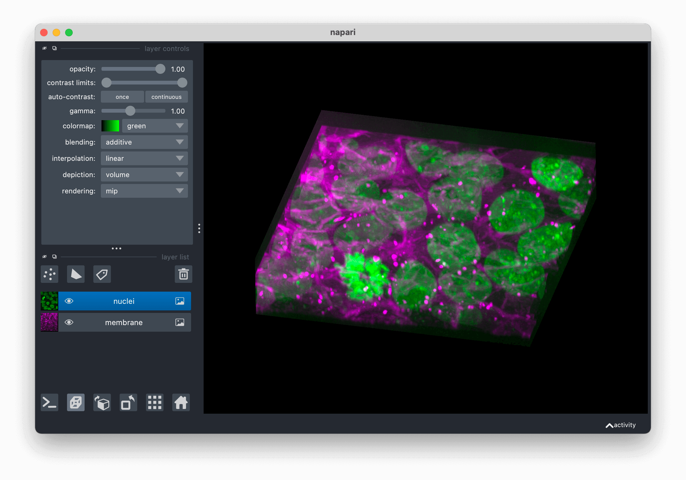

---
jupytext:
  text_representation:
    extension: .md
    format_name: myst
    format_version: 0.13
    jupytext_version: 1.10.3
kernelspec:
  display_name: Python 3
  language: python
  name: python3
---

# Using the image layer

In this document, you will learn how to use the `napari` image layer, including
the types of images that can be displayed, and how to set properties like the
contrast, opacity, colormaps and blending mode. You will also understand how
to add and manipulate a variety of different types of images both from the GUI
and from the console.

## A simple example

You can create a new viewer and add an image in one go using the
`napari.view_image` function, or if you already have an existing viewer, you can
add an image to it using `viewer.add_image`. The api of both methods is the
same. In these examples we'll mainly use `view_image`.

A simple example of viewing an image is as follows:

```{code-cell} python
import napari
from skimage import data

cells = data.cells3d()[30, 1]  # grab some data
viewer = napari.view_image(cells, colormap='magma')
```

```{code-cell} python
:tags: [hide-input]

from napari.utils import nbscreenshot

nbscreenshot(viewer, alt_text="Cells")
```

```{code-cell} python
:tags: [remove-cell]

viewer.close()
```

## Arguments of `view_image` and `add_image`

{meth}`~napari.view_layers.view_image` and {meth}`~napari.Viewer.add_image`
accept the same layer-creation parameters.

```{code-cell} python
:tags: [hide-cell]

help(napari.view_image)
```

## Image data and NumPy-like arrays

napari can take any numpy-like array as input for its image layer. A numpy-like
array can just be a
[numpy array](https://numpy.org/doc/stable/reference/generated/numpy.array.html),
a [dask array](https://docs.dask.org/en/stable/array.html), an
[xarray](http://xarray.pydata.org/en/stable/generated/xarray.DataArray.html), a
[zarr array](https://zarr.readthedocs.io/en/stable/api/core.html), or any other
object that you can index into and when you call
[`np.asarray`](https://numpy.org/doc/stable/reference/generated/numpy.asarray.html)
on it you get back a numpy array.

The great thing about napari support of array-like objects is that you get to keep
on using your favorite array libraries without worrying about any conversions as
we'll handle all of that for you.

napari will also wait until just before it displays data onto the screen to
actually generate a numpy array from your data, and so if you're using a library
like `dask` or `zarr` that supports lazy loading and lazy evaluation, we won't
force you load or compute on data that you're not looking at. This enables
napari to seamlessly browse enormous datasets that are loaded in the right way.
For example, here we are browsing over 100GB of lattice lightsheet data stored
in a zarr file:


## Multiscale images

For exceptionally large datasets napari supports multiscale images (sometimes
called image pyramids). A multiscale image is a list of arrays, where each
array is downsampling of the previous array in the list, so that you end up
with images of successively smaller and smaller shapes. A standard multiscale
image might have a 2x downsampling at each level, but napari can support any
type of multiscale image as long as the shapes are getting smaller each time.

Multiscale images are especially useful for incredibly large 2D images when
viewed in 2D or incredibly large 3D images when viewed in 3D. For example this
~100k x 200k pixel pathology image consists of 10 pyramid levels and can be
easily browsed as at each moment in time we only load the level of the
multiscale image and the part of the image that needs to be displayed:


This example had precomputed multiscale images stored in a zarr file, which is
best for performance. If, however you don't have a precomputed multiscale image
but try and show a exceptionally large image napari will try and compute the
multiscale image for you unless you tell it not too.

You can use the `multiscale` keyword argument to specify if your data is a
multiscale image or not. If you don't provide this value, then will try and
guess whether your data is or needs to be a multiscale image.

## Loading multichannel images

Each channel in a multichannel image can be displayed as an individual layer
by using the `channel_axis` argument in `viewer.add_image()`. All the rest
of the arguments to `viewer.add_image()` (e.g. name, colormap, contrast_limit)
can take the form of a list of the same size as the number of channels.

For example, the multichannel image below has dimensions (60, 2, 256, 256) with
axes ordered ZCYX (so the channel axis has an index of 1). It is loaded into
napari in one line.

```{code-cell} python
import napari
from skimage import data

cells = data.cells3d() #ZCYX image data

# load multichannel image in one line
viewer = napari.view_image(cells, channel_axis=1)

# load multichannel image in one line, with additional options
viewer = napari.view_image(
        cells,
        channel_axis=1,
        name=["membrane", "nuclei"],
        colormap=["green", "magenta"],
        contrast_limits=[[1000, 20000], [1000, 50000]],
        )

```



## Viewing RGB vs luminance (grayscale) images

In this example we explicitly set the `rgb` keyword to be `True`
because we know we are working with an `rgb` image:

```{code-cell} python
viewer = napari.view_image(data.astronaut(), rgb=True)
```

```{code-cell} python
:tags: [hide-input]

from napari.utils import nbscreenshot

nbscreenshot(viewer, alt_text="napari viewer with the left sidebar layer controls and an image of astronaut Eileen Collins. In the layer controls, the colormap is fixed to RGB")
```

```{code-cell} python
:tags: [remove-cell]

viewer.close()
```

If we had left that keyword argument out napari would have successfully guessed
that we were trying to show an `rgb` or `rgba` image because the final dimension
was 3 or 4. If you have a luminance image where the last dimension is 3 or 4 you
can set the `rgb` property to `False` so napari handles the image correctly.

`rgb` data must either be `uint8`, corresponding to values between 0 and 255, or
`float` and between 0 and 1. If the values are `float` and outside the 0 to 1
range they will be clipped.

## Working with colormaps

napari supports any colormap that is created with `vispy.color.Colormap`. We
provide access to some standard colormaps that you can set using a string of
their name. These include:

```{code-cell} python
list(napari.utils.colormaps.AVAILABLE_COLORMAPS)
```

Passing any of these strings as follows to set the image colormap:

```{code-cell} python
viewer = napari.view_image(data.moon(), colormap='red')
```

You can also access the current colormap through the `layer.colormap` property
which returns a tuple of the colormap name followed by the vispy colormap
object. You can list all the available colormaps using `layer.colormaps`.

It is also possible to create your own colormaps using vispy's
`vispy.color.Colormap` object; see its full [documentation
here](https://vispy.org/api/vispy.color.colormap.html#vispy.color.colormap.Colormap).
Briefly, you can pass `Colormap` a list of length 3 or length 4 lists,
corresponding to the `rgb` or `rgba` values at different points along the
colormap.

For example, to make a diverging colormap that goes from red to blue through
black, and color a random array you can do the following:

```{code-cell} python
import napari
import numpy as np
from vispy.color import Colormap

cmap = Colormap([[1, 0, 0], [0, 0, 0], [0, 0, 1]])
image = np.random.random((100, 100))

viewer = napari.view_image(image, colormap=('diverging', cmap))
```

```{code-cell} python
:tags: [hide-input]

from napari.utils import nbscreenshot

nbscreenshot(viewer, alt_text="napari viewer with colormap example using random data")
```

Note in this example how we passed the colormap keyword argument as a tuple
containing both a name for our new custom colormap and the colormap itself. If
we had only passed the colormap it would have been given a default name.

The named colormap now appears in the dropdown menu alongside a little thumbnail
of the full range of the colormap.

## Adjusting contrast limits

Each image layer gets mapped through its colormap according to values called
contrast limits. The contrast limits are a 2-tuple where the second value is
larger than the first. The smaller contrast limit corresponds to the value of
the image data that will get mapped to the color defined by 0 in the colormap.
All values of image data smaller than this value will also get mapped to this
color. The larger contrast limit corresponds to the value of the image data that
will get mapped to the color defined by 1 in the colormap. All values of image
data larger than this value will also get mapped to this color.

For example, you are looking at an image that has values between 0 and 100 with
a standard `gray` colormap, and you set the contrast limits to `(20, 75)`. Then
all the pixels with values less than 20 will get mapped to black, the color
corresponding to 0 in the colormap, and all pixels with values greater than 75
will get mapped to white, the color corresponding to 1 in the colormap. All
other pixel values between 20 and 75 will get linearly mapped onto the range of
colors between black and white.

In napari you can set the contrast limits when creating an `Image` layer or on
an existing layer using the `contrast_limits` keyword argument or property,
respectively.

```{code-cell} python
viewer = napari.view_image(data.moon(), name='moon')
viewer.layers['moon'].contrast_limits=(100, 175)
```

```{code-cell} python
:tags: [hide-input]

from napari.utils import nbscreenshot

nbscreenshot(viewer, alt_text="A viewer where the contrast limits have been adjusted")
```

```{code-cell} python
:tags: [remove-cell]

viewer.close()
```

Because the contrast limits are defined by two values the corresponding slider
has two handles, one the adjusts the smaller value, one that adjusts the larger
value.

As of right now adjusting the contrast limits has no effect for `rgb` data.

If no contrast limits are passed, then napari will compute them. If your data is
small, then napari will just take the minimum and maximum values across your
entire image. If your data is exceptionally large, this operation can be very
time consuming and so if you have passed an image pyramid then napari will just
use the top level of that pyramid, or it will use the minimum and maximum values
across the top, middle, and bottom slices of your image. In general, if working
with big images it is recommended you explicitly set the contrast limits if you
can.

Currently if you pass contrast limits as a keyword argument to a layer then full
extent of the contrast limits range slider will be set to those values.

## Saving without image compression

When saving a labels layer, lossless zlib compression is applied by default. 
 To save with a different level of compression, consider using 
 [imageio.imwrite](https://imageio.readthedocs.io/en/stable/_autosummary/imageio.v3.imwrite.html).  
Adjusting compression can be accomplished by including the appropriate kwargs 
as outlined in the following locations for 
[tiff](https://imageio.readthedocs.io/en/stable/_autosummary/imageio.plugins.tifffile.html#metadata-for-writing) or 
[png](https://pillow.readthedocs.io/en/stable/handbook/image-file-formats.html#png) files. 
