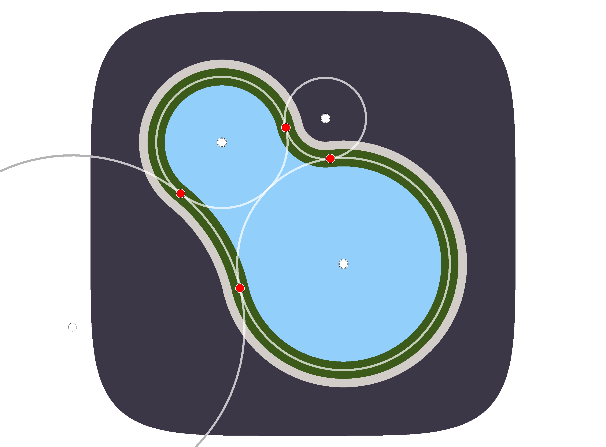
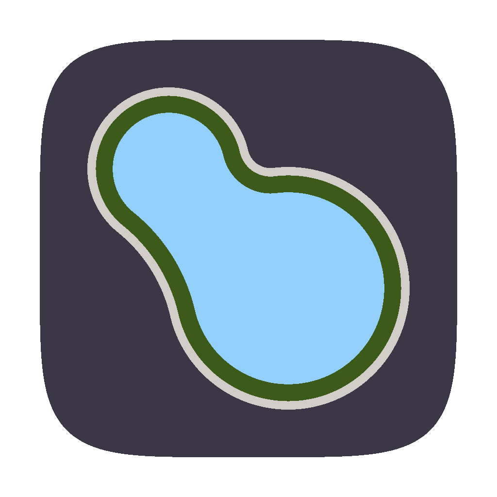

:orphan:

(nap-template)=

# NAP-5 — New logo (2022)

```{eval-rst}
:Author: Juan Nunez-Iglesias <jni@fastmail.com>
:Created: 2022-09-08
:Resolution: <url> (required for Accepted | Rejected | Withdrawn)
:Resolved: <date resolved, in yyyy-mm-dd format>
:Status: Draft
:Type: Standards Track
:Version effective: 0.5
```

## Abstract

This NAP proposes a new, mathematically-defined logo for napari.

## Motivation and Scope

The original napari logo was simply a square crop of [this
image](https://en.wikipedia.org/wiki/Napari#/media/File:Tabuaeran_Kiribati.jpg)
of Tabuaeran, the island containing the village of Napari — the namesake of
this project:


A few months later, Jeremy Freeman, then director of Computational Biology at
CZI, and a bit of a design nerd, traced the island and gave us our current,
stylised version of that image.


Being, the shape is very irregular — no one knows what it is — and the
gradients, the border around the logo, and the slightly rounded corners on a
very square shape all look dated in 2022.

This NAP deals specifically with the *shape* of the logo. It proposes specific
colors for each logo element but is not strongly opinionated on them — they can
be decided in the implementation phase, and perhaps in subsequent NAPs.

## Detailed Description

This proposal keeps the original inspiration of the Tabuaeran atoll, which is
quite beautiful and has the added bonus of looking a bit like a dividing cell.
However, it goes much further in the styling.

The proposed logo draws the two "lobes" of the island as two touching circles,
with the radius of the smaller (northwest) circle being a factor of $\phi$
smaller than the larger one, where $\phi = \frac{1 + \sqrt{5}}{2}$ denotes the
[golden ratio](https://en.wikipedia.org/wiki/Golden_ratio).

The "neck" of the island is *also* defined by two *external* circles: one
smaller again by $\phi$ than the smaller circle, and one larger again than the
bigger circle. In this way, the island is defined by four circles of increasing
radius, with each increase a factor of $\phi$:



Additionally, the background of the logo is a
[squircle](https://www.johndcook.com/blog/2018/02/13/squircle-curvature/) of
degree 5, as Apple [uses](https://stackoverflow.com/a/47342594/224254) for iOS
and macOS icons currently.

Overall, the new icon still keeps the "napari" character, while looking more
modern, friendlier, and more abstract. This is an advantage for those who don't
know the origin of the logo, as they would still be able to appreciate the
regularity of the shapes used.

Additionally, the logo looks quite a bit like a dividing budding yeast *(S.
cerevisiae)*, rather than an amorphous anonymous cell, which anyone with a
background in biology would appreciate!

Here is the proposed logo:



## Related Work

N/A

## Implementation

This is the fun bit. 😃

The logo proposed above is generated *entirely within napari*. It makes use of:

- A Shapes layer for each element: the background, the sand, the rainforest,
  and the lagoon.
- Scaling, translation, and rotation on each layer: the arithmetic for finding
  the exact centers and contact points of all the circles is much easier with
  the origin at the center of the north-west circle, a radius of
  $1/\phi = \phi - 1$, and the island aligned along the 0th (vertical) axis.
  Similarly, the squircle is easier to draw with the origin at the center. I
  then apply scale, translation and rotation so that the island is at 45° and
  the logo fills the space in [[0, 1024], [0, 1024]].
- NumPy for computation of all the lines and shapes.

Additionally, napari was used extensively during the development, to debug
errors in calculating the contact points and so on. 😅

It's very fun to work with powers of $\phi$: $1/\phi = \phi - 1$, which implies
$1/\phi^2 = (\phi - 1)/\phi = 1 - 1/\phi = 2 - \phi$, and so on. Similarly,
$\phi^2 = 1 + \phi$, which again lets you reduce all polynomials of $\phi$ to
degree 1.

The original implementation is at https://github.com/jni/new-napari-logo, but
if this NAP is accepted, it would add the logo-generating script as a gallery
example.

Another bit of mathematical fun: Veritasium calls $\phi$ "the fiveiest number"
(in [this fantastic video](https://youtu.be/48sCx-wBs34)): it is the ratio of
the diagonal of a regular pentagon to its side, and it can be written as
$\phi = 0.5 + 0.5 \times 5^{0.5}$! So it is a happy not-quite-coincidence that
this is NAP-5. 😉

## Backward Compatibility

This NAP does not raise backwards compatibility concerns.

## Future Work

As mentioned above, this NAP is about the shapes of the logo, not the colors.
The colors are sampled from Wikipedia's satellite image of Tabuaeran, except for
the lagoon, which is the turquoise of the napari-hub and napari sphinx theme.
It's kinda nice to have those match, but not necessary. We *could* change the
color to be more natural (again sampled from the satellite) *and* update our
themes to match. Or we could simply pick a more natural color for the lagoon,
again from the satellite image, and forget about matching them.

I will take the opportunity to express two strong opinions:
- I think some form of "ocean purple" is absolutely necessary for the
  background, as I think it's become part of our identity on account of our
  existing logo.
- Whatever exact colors we pick, I think they should continue to evoke the
  island: ocean, sand, forest, lagoon. There's a lot of range in that space but
  I think we should keep to that constraint.

If anyone is keen to experiment with different colors I would be glad to pass
the design baton over.

Other design questions:

- Do we want a slight drop shadow? It is quite standard in macOS icons, and
  one looks quite sparse without it.
- Do we want a sunlight reflection/sheen on the ocean part? I'm open to it.
- For either of those, ideally, we would keep the image processing in Python
  and napari.

## Alternatives

We could of course go for a more traditionally developed logo. However, I think
the mathematical story and the ability to generate the logo *using* napari are
actually important. So I'd love to keep at least a large part of the concept
for the logo, regardless of where this NAP lands.

It's been suggested that the squircle shape might make it harder to tile a
laptop together with other stickers, or align the edges. However, I think the
tiling issue is a red herring because a quick look at the [NumFOCUS sticker
table](https://twitter.com/NumFOCUS/status/1547651122654916609) shows that most
related projects have irregularly-shaped stickers anyway. Additionally, I think
that the squircle provides both a long enough straight edge (almost 1/3 of each
side is exactly straight) to align things, but the smooth curvature makes
slight misalignments perceptually harder to notice than a perfect straight edge.

At any rate, we can provide a variety of background shapes for different
contexts anyway. I think the squircle shape is indeed more visually appealing
than a square with rounded corners thanks to its "curvature continuity." If we
prefer a straighter edge, we can easily increase the degree of the squircle.

## Discussion

This section will be updated with links as we discuss the NAP.

## References and Footnotes

## Copyright

This document is dedicated to the public domain with the Creative Commons CC0
license [^id3]. Attribution to this source is encouraged where appropriate, as per
CC0+BY [^id4].

[^id3]: CC0 1.0 Universal (CC0 1.0) Public Domain Dedication,
    <https://creativecommons.org/publicdomain/zero/1.0/>

[^id4]: <https://dancohen.org/2013/11/26/cc0-by/>
