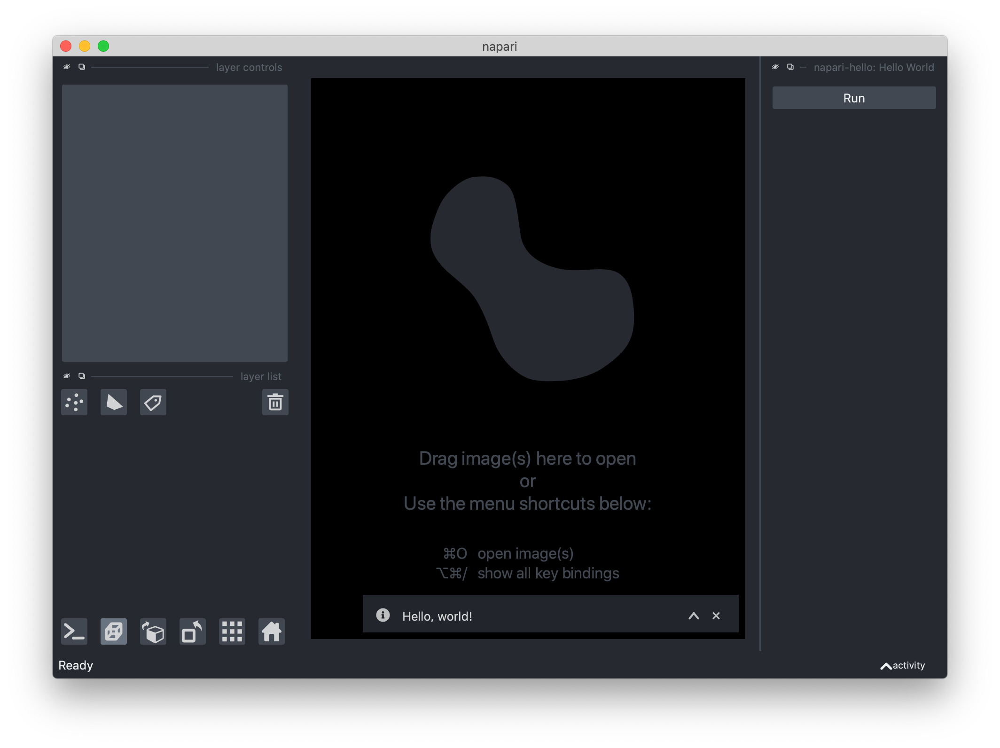

# Your First Plugin

In this tutorial, we'll step through the fundamental concepts for building a
**bare minimum** "hello napari" plugin from scratch.

At the end, we'll point you to a "cookiecutter" template
repository that helps automate the creation of new plugins, and adds a number
of conveniences for testing, maintaining, and deploying your plugin.

````{admonition} new plugin format!
:class: important
This page describes the creation of a plugin targeting `npe2`, the second
generation plugin engine.
````

## Before you start

We assume you've set up a Python virtual environment (using a virtual
environment instead of a global python installation is **highly
recommended**). If you are new to virtual environments, we recommend
[installing miniconda][miniconda] and [creating a new environment with
python][python_env].

Even though plugins don't necessarily need to list `napari` as a direct dependency, and
[should not depend on a specific Qt backend](best-practices-no-qt-backend),
you will need a working installation of napari in your active Python
environment to use and test your plugin.
See the [installation guide](installation) if this is your first time
installing napari.


## What is a plugin?

Napari plugins are just Python packages. *Minimally*, they must:

1. Include a static [plugin manifest](./manifest) file that details the
   [contributions](./contributions) contained in the plugin.
2. Declare a `napari.manifest` [entry point][entry_points] that allows
   napari to detect the plugin at runtime.


## 1. Create a new directory

Let's create a new folder called `napari-hello` for your plugin files,
and navigate into it.

```sh
mkdir napari-hello
cd napari-hello
```

## 2. Add standard Python package metadata files

In your root `napari-hello` folder, create a `pyproject.toml` and `setup.cfg` file,
then create a `napari_hello` directory with a single `__init__.py` file inside of it.

````{tabbed} macOS / Linux
```sh
mkdir napari_hello
touch napari_hello/__init__.py napari_hello/napari.yaml pyproject.toml setup.cfg
```
````

````{tabbed} Windows
```bat
mkdir napari_hello
copy /b napari_hello\__init__.py +,,
copy /b napari_hello\napari.yaml +,,
copy /b pyproject.toml +,,
copy /b setup.cfg +,,
```
````

Your project should now look like this:

```
~/napari-hello/
├── napari_hello/
│   ├── __init__.py
│   └── napari.yaml
├── pyproject.toml
├── setup.cfg
```

````{admonition} **napari-hello** vs **napari_hello**
:class: tip
You might notice that we used a **dash** in our top level folder, and an
**underscore** in the inner folder. This is the Python convention:
*distribution packages* use dashes, while Python *files* and *modules* use
underscores. Our *package* is named `napari-hello`, and it includes a
single top-level module, called `napari_hello`.

You would *install* this package with
```sh
pip install napari-hello
```

... and *import* it with ...
```python
import napari_hello
```
````

Next, we will populate `pyproject.toml` and `setup.cfg`

### `pyproject.toml`

```{note}
`pyproject.toml` is a standard file (introduced in
[PEP518](https://peps.python.org/pep-0518/), May 2016) that tells
the Python package installer [pip](https://pip.pypa.io/en/stable/) how to
build your package. For more background, see
[Clarifying PEP 518](https://snarky.ca/clarifying-pep-518/) and
[What the heck is pyproject.toml?](https://snarky.ca/what-the-heck-is-pyproject-toml/).
```

Here, we declare we want to use [setuptools](https://setuptools.pypa.io/en/latest/)
for packaging our plugin.  Paste the following text into `pyproject.toml`:

```toml
[build-system]
requires = ["setuptools", "wheel"]
build-backend = "setuptools.build_meta"
```

### `setup.cfg`

This file is where [setuptools](https://setuptools.pypa.io/en/latest/)
looks for package metadata. Here, we provide the bare minimum package metadata
(name and version), along with a [PyPI classifier](https://pypi.org/classifiers/)
that identifies the package as a napari plugin.

Paste the following text into `setup.cfg`:

```ini
[metadata]
name = napari-hello
version = 0.0.1
classifiers =
    Framework :: napari

[options]
packages = find:
```

There is a *lot* more than can go in the package metadata.
See the [setuptools quickstart](https://setuptools.pypa.io/en/latest/userguide/quickstart.html)
for more.

## 3. Implement the plugin

So far, we've done nothing napari-specific.  Let's create the actual plugin and add
some Python code. We're going to add a
[Widget contribution](contributions-widgets)
with a single button that shows a "Hello, world!" message when clicked.

### Add plugin functionality to `napari_hello/__init__.py`

Copy and paste the following text into the file at `napari_hello/__init__.py`.
It just uses the napari notifications API to show a message:

```python
from napari.utils.notifications import show_info

def show_hello_message():
    show_info('Hello, world!')
```

*(It doesn't look like a widget yet! We're going to use napari's widget
autogeneration capabilities to turn this function into a widget)*


### Add a `napari.yaml` manifest


If you haven't already, create an empty [plugin manifest](./manifest) file at `napari_hello/napari.yaml`
We will use this file to tell napari:

1. That our plugin contributes a [**command**](contributions-commands)
   (we give the command an ID of `napari-hello.say_hi`. It must start with our plugin
   name, and be unique).
2. The location of the function that executes the command (the `python_name`, pointing
   to the `show_hello_message` function in the `napari_hello` module).
3. That our plugin contributes a [**widget**](contributions-widgets),
   and that we'd like napari to **autogenerate** the widget from the command signature
   (so we don't need to deal with any GUI code).

Add the following text to `napari.yaml`:

```yaml
name: napari-hello
contributions:
  commands:
    - id: napari-hello.say_hi
      title: Say hello, world!
      python_name: napari_hello:show_hello_message
  widgets:
    - command: napari-hello.say_hi  # note, same as command.id above
      display_name: Hello World
      autogenerate: true
```

```{tip}
We could have put the `show_hello_message` function anywhere, it didn't
need to go in the top `__init__.py` file. Just make sure that the `python_name`
of the corresponding `command` in the manifest points to the correct
`<module_name>:<function_name>`.
```

### Update `setup.cfg`

Lastly, let's make a few small changes to `setup.cfg`.

1. Because we are directly using the `napari.utils.notifications` API in our,
   `show_hello_message` function, we need to add `napari` to our package
   **`install_requires`**. (You should add *all* of your package dependencies
   here.  Assume nothing about your user's environment!  Not even napari.)

2. We need to instruct setuptools to *include* that `napari.yaml` file
   when it bundles our package for distribution, by adding
   **`include_package_data = True`** to the `[options]` section.

3. In order for napari to find our plugin when it's installed in
   the environment, we need to add a `napari.manifest` entry to our
   **`[options.entry_points]`** that points to the `napari.yaml`
   file we added to the `napari_hello` module.

    ```{tip}
    Entry points are a standard Python mechanism for an installed distribution to
    advertise components it provides to be discovered and used by other code.

    See the [Entry points specification][entry_points] for details.
    ```

With the above changes, your final `setup.cfg` file should look like this:

```ini
[metadata]
name = napari-hello
version = 0.0.1
classifiers =
    Framework :: napari

[options]
packages = find:
include_package_data = True
install_requires =
    napari

[options.entry_points]
napari.manifest =
    napari-hello = napari_hello:napari.yaml
```

## 4. Install your plugin and try it out!

With that, we're ready to go.  Let's install our package in the environment
and then run napari.  Note: we're using `pip install -e .` here to install our
package (in the current working directory) in ["editable" mode][editable_mode].
This means that changes we make to our package during development will be
detected when we re-run napari, without having to run `pip install` again.

```sh
pip install -e .
napari
```

Once napari starts, select `napari-hello: Hello World` from the
`Plugins` menu, then click the `Run` button to see the message.

% 

## Get going quickly with cookiecutter

Now that you've learned all of the critical steps for creating a plugin,
you can use our [cookiecutter template repository][cookiecutter]
to get up and running quickly with each new plugin.
This will ask you a few questions about your new plugin, and
autogenerate a package structure much like the one above. It additionally
includes conveniences like testing, continuous integration, version
management, and deployment hooks.

```sh
pip install cookiecutter
cookiecutter https://github.com/napari/cookiecutter-napari-plugin
```

## Next Steps

Plugins can do a lot more than just say hi!  You can see the complete list
of available contributions and their fields in the
[Contributions Reference](./contributions), and learn more about each
specific contribution type in the [Guides](./guides).

Review the [Best Practices](./best_practices) when developing plugins and,
when you're ready to share your plugin, see [Testing and Deployment](./test_deploy).

[miniconda]: https://docs.conda.io/projects/conda/en/latest/user-guide/install/download.html
[python_env]: https://docs.conda.io/projects/conda/en/latest/user-guide/getting-started.html#managing-python
[editable_mode]: https://pip.pypa.io/en/stable/cli/pip_install/#editable-installs
[cookiecutter]: https://github.com/napari/cookiecutter-napari-plugin
[entry_points]: https://packaging.python.org/en/latest/specifications/entry-points/
