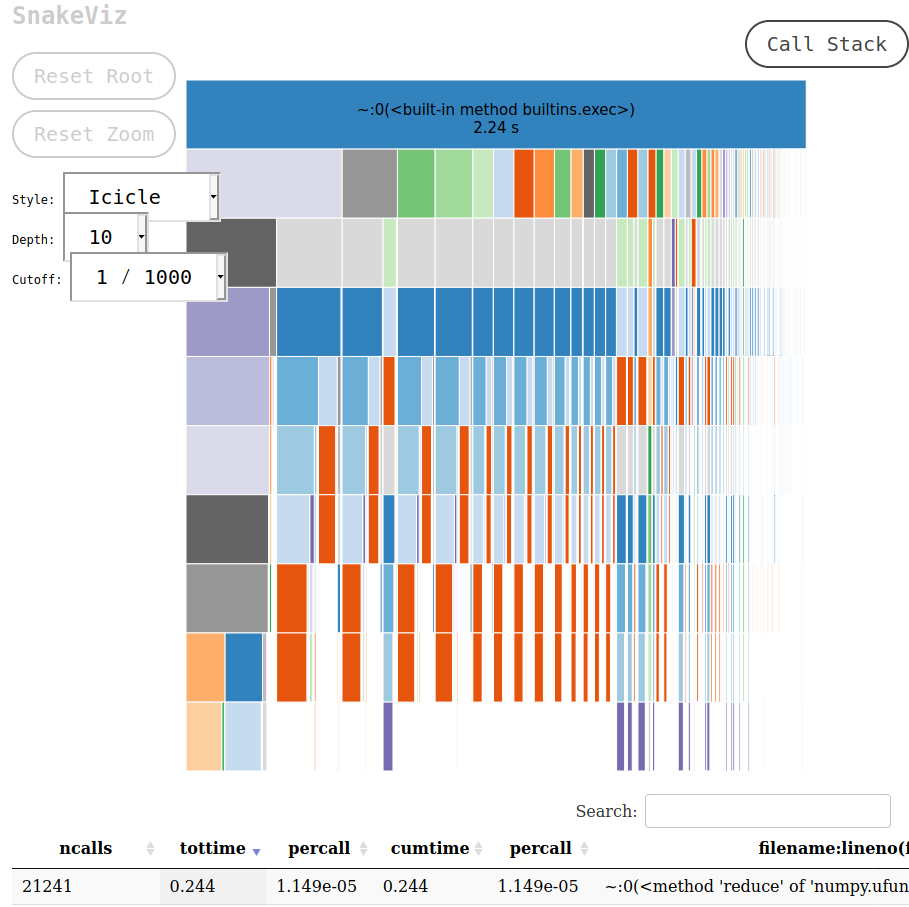

# Profiling

In comparison to performance tracing profiling does not provide information about time of events but provide 
combined information about time of execution of functions and allow producing call graph which simplify tracing 
relations between functions.   


The basic tool for perform profile is build in python module `cProfile`. For profile whole script use:

```bash
python -m cProfile path_to_script.py
```

The output of this call will be such table:

```
         2334264 function calls (2267576 primitive calls) in 2.242 seconds

   Ordered by: internal time

   ncalls  tottime  percall  cumtime  percall filename:lineno(function)
    21241    0.252    0.000    0.252    0.000 {method 'reduce' of 'numpy.ufunc' objects}
80547/57578    0.080    0.000    0.765    0.000 {built-in method numpy.core._multiarray_umath.implement_array_function}
     1048    0.060    0.000    0.060    0.000 {built-in method marshal.loads}
    62683    0.052    0.000    0.052    0.000 {built-in method numpy.array}
  122/117    0.042    0.000    0.047    0.000 {built-in method _imp.create_dynamic}
     5152    0.042    0.000    0.053    0.000 stride_tricks.py:114(_broadcast_to)
     5102    0.037    0.000    0.048    0.000 decomp_qr.py:11(safecall)
     2551    0.031    0.000    0.386    0.000 transform_utils.py:153(decompose_linear_matrix)
     2651    0.029    0.000    0.067    0.000 transforms.py:342(__call__)
2172/2108    0.029    0.000    0.087    0.000 {built-in method builtins.__build_class__}
    18283    0.027    0.000    0.278    0.000 fromnumeric.py:70(_wrapreduction)
...
```
To understand this output we suggest reading: https://docs.python.org/3/library/profile.html#instant-user-s-manual.
Because output for napari will be very long we suggest ot pip output to `less` command or save it to file,
which could be investigated later using command:

```bash
python -m cProfile -o result.pstat path_to_script.py
```

There are few options for check content of `pstat` file.  

1.  The Stat object.
    
    Profiling output could be parsed and viewed using `Stats` object from `pstat` library. Example usage:
    ```python
    from pstats import Stats
    stat = Stats("path/to/result.pstat")
    stat.sort_stats("tottime").print_stats(10)
    ```
    Documentation here https://docs.python.org/3/library/profile.html#the-stats-class

2.  Snakeviz.
    
    If You do not have `snakeviz` command available then ensure than your developer environment 
    is active and call `pip install snakeviz`. To visualize profiling use command:
    ```bash
    snakeviz path/to/result.pstat   
    ```
    Then in your browser should be opened a new tab with similar content
    

3.  gprof2dot

    For using this method there is need to have `graphviz` installed in your system.  
    To install:
    
    * Ubuntu: `sudo apt install graphviz`
    * MacOS with brew: `brew install graphviz`

Let's have simple code for check speed of adding multiple layers to napari viewer:

```python
import numpy as np
import napari

data = []
for i in range(50):
    data.append(np.random.random((1000, 2)))

viewer = napari.components.ViewerModel()

for i, points in enumerate(data):
    viewer.add_points(points, visible=False)
```

then profile it with command:

```bash
python -m cProfile -o many_layers.pstat many_layers.py
```