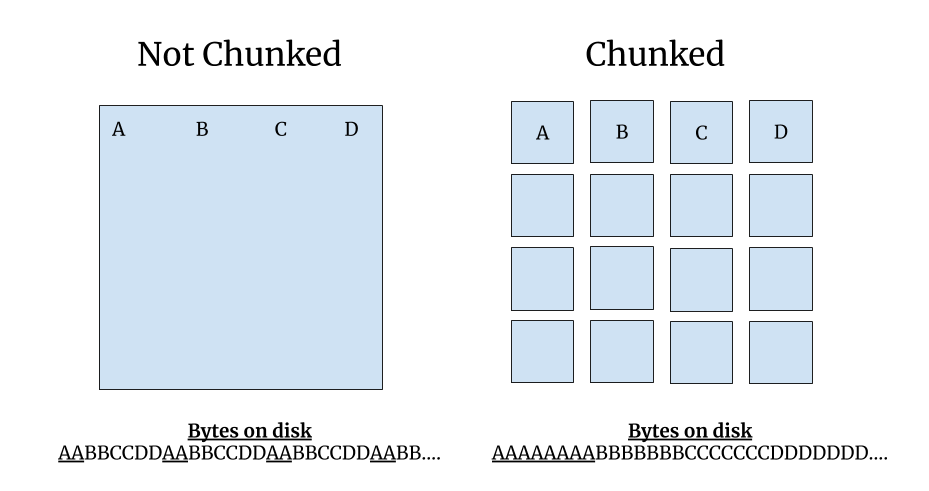
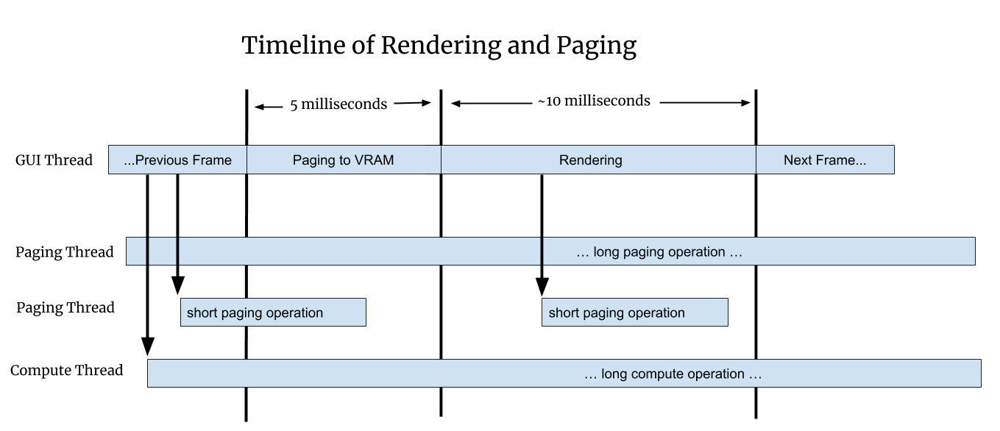

# Rendering in napari

## Status

As of September 2020, we are in the process of merging an experimental
implementation of asynchronous rendering for the `Image` layer into master,
so that Napari user's can optionally toggle it on and experiment with it.
Initially the asynchronous rendering is only fully implemented for
single-scale images, support for multi-scale images is partial. Later we
plan to add full support for chunked multi-scale images, 3D images, and
eventually asynchronous rendering support for all layer types.

## Framerate

The ideal framerate for a graphics application is 60Hz because this is the
most common refresh rate for screens. The goal is that every time the
screen refreshes the renderer can draw something new, which means anything
in motion will appear to move smoothly, such as when panning or zooming the
camera. If 60Hz cannot be achieved the application should draw as fast as
possible, because the user experience degrades rapidly as the framerate
gets slower:

```eval_rst
========== ============= =================
Framerate  Milliseconds  User Experience
========== ============= =================
60Hz       16.7          Great
30Hz       33.3          Good
20Hz       50            Acceptable
10Hz       100           Bad
5Hz        200           Unusable
========== ============= =================
```
The issue is not just aesthetic. Manipulating user interface elements like
sliders becomes almost impossible if the framerate is really slow, and it
can be a deeply frustrating experience for the user as they struggle to
use the application. Furthermore, if Napari does not respond to events at
all for a few seconds, the operating system might indicate to the user that
the application is crashing, for example MacOS will show the "spinning
wheel of death".

A fast average framerate is important, but it's also important that Napari
does not have even isolated slow frames, and does not have a framerate that
bounces around. A jumpy framerate leads to something called
[jank](http://jankfree.org/). For the best user experience we want a
framerate that's fast, but also one that's consistently fast.

## Array-like Interface

Napari renders data out of an array-like interface. The data can owned by
any object that supports `numpy`'s slicing syntax. This is flexible and
powerful, but it means that simple array accesses can result in the
execution of arbitrary code, code that may perform IO or computations,
using [Dask](https://dask.org/) or some other means. This means array
accesses can take an arbitrary long time to complete.


## Asynchronous Rendering

Since we don't know how long an array access will take, and we never want
the GUI thread to block, we cannot access arrays in the GUI thread unless
we know they are fully in memory. Instead, Napari's rendering has to be
done _asynchronously_.

The renderer will only draw data that is fully in memory, so that it never
blocks on IO or computations. Meanwhile, more data will be loaded into
memory in the background. The frame after the data is loaded the renderer
will draw the new data along with the previously drawn data. This
necessarily means that Napari will sometimes draw partially loaded data.
For example, it might draw only portions of a full image or draw images
that are blurry, until the data has fully loaded.

Issues that Napari has without asynchronous rendering include
[#845](https://github.com/napari/napari/issues/845),
[#1300](https://github.com/napari/napari/issues/1300), and
[#1320](https://github.com/napari/napari/issues/1320]).

## VRAM

Even if the data is loaded into RAM fully in the background, Napari still
needs to move the data from RAM into VRAM. Unlike the load into RAM, the
transfer into VRAM must be done by the GUI thread. If the data is too large
then loading it will cause a slow frame that the user will notice.

This leads to the requirement that all data needs to be broken into chunks,
where a chunk is a deliberately vague term for a portion of the data that
Napari can load and render independently. The chunk size needs to be small
enough that the renderer can at least load one chunk per frame into VRAM
without a framerate glitch, so that over time all chunks can be loaded into
VRAM smoothly.

## Renderer Requirements

The above discussion leads to two rigid requirements for rendering:

1. Never call `asarray` on user data from the GUI thread, since we don't know
   what it will do or how long it will take.
2. Always break data into chunks. The exact maximum chunk size is TBD.

## Render Algorithm

The renderer computes a **working set** of chunks based on the current
view. The working set is the set of chunks that we need to draw in order to
depict the current view of the data. The renderer will step through every
chunk in the working set and do one of these three things:

```eval_rst
============================= ============================================
Case                          Action
============================= ============================================
Chunk is in VRAM              Render the chunk
Chunk is in RAM but not VRAM  Transfer the chunk to VRAM if there is time
Chunk is not in RAM           Ask the `ChunkLoader` to load the chunk
============================= ============================================
```

The important thing about this algorithm is that it never blocks. It draws
what it can draw without blocking, and then loads more data so that it can
draw more in the future.

## Chunks and Partial Rendering

A chunk is simply a portion of what we need to load and render. A chunk
will often be a region of space like a tile or a sub-volume, but it could
be some other part of the whole, such as a layer or some portion of the
geometry.

If only a subset of the desired chunks are in memory, then Napari can only
render that portion of the data. However, rendering a portion of the data
quickly is often much better for the user than waiting until the data is
fully loaded. Users can often interpret and navigate their data even if
they can only see part of it. Thus asynchronous rendering with partial
draws can vastly speed up the user's ability to analyze and interact with
their data.

### Chunked File Formats

Chunks will often be blocks of contiguous memory inside a chunked file
format like [Zarr](https://zarr.readthedocs.io/en/stable/), and exposed by
an API like Dask.

If an image is stored without chunks then reading a 2D region of the image
might require many different read operations, since the bytes for that
region are spread throughout the linear file, interspersed with the bytes
from other geographic regions. In contrast with a chunked file you can read
a rectangular region with a single linear read operation.



For 3D images the chunks are 3D sub-volumes instead of 2D tiles, but the
benefits are exactly the same.
[Neuroglancer](https://opensource.google/projects/neuroglancer) recommends
that data is stored in 64x64x64 chunks, which means that each chunk
contains 262,144 voxels. Those 256k voxels can be read with one read
operation. Using cubic chunks is nice because you get the same performance
whether you are viewing the data in XY, XZ or YZ orientations. It's also
nice because you can scroll through slices quickly since on average 32
slices above and below your current location are already in RAM.

### Render Chunks

If a chunked file format is available, and those chunks are reasonably
sized, then Napari can use those chunks for rendering. If chunks are not
available, for example with issue
[#1300](https://github.com/napari/napari/issues/1300), or the chunks are
too large, then Napari will have to break the data into render chunks
itself.

Note that with issue [#1320](https://github.com/napari/napari/issues/1320)
the images are small so they are not chunked, but in that issue there are 3
image **layers** per slice. In that case the *image layers are our chunks*.
In general we can get creative with chunks, they can be spatial or
non-spatial subdivisions, basically anything we want. As long as something
can be loaded and drawn independently it can be a chunk.

## Loading into RAM and VRAM

The _working set_ is the set of chunks we need to draw for a given view of
the data. Each frame Napari will draw only the chunks in the working set
which are in VRAM. Meanwhile, in the background it will load more chunks
into RAM, and transfer data from RAM and then into VRAM. This two-step
paging process into RAM and then into VRAM is what will give Napari a fast
and consistently fast framerate, even when viewing huge or slow-loading
data.


When the rendering process is viewed as a timeline, the rendering thread
has regularly spaced frames, while the IO and compute threads load data
into RAM in parallel. When a paging or compute operation finishes, it puts
the data into RAM and marks it as available, so the renderer can use it
during the next frame.



## Example: Computed Layers

In [#1320](https://github.com/napari/napari/issues/1320) the images are not
chunked since they are very small, but there are 3 layers per slice. These
per-slice layers are our chunks. Two layers are coming off disk quickly,
while one layer is computed, and that can take some time.

Without asynchronous rendering we did not draw any of the layers until the
slowest one was computed. With asynchronous rendering the user can scroll
through the paged layers quickly, and then pause a bit to allow the
computed layer to load in. Asynchronous rendering greatly improves the
user's experience in this case.


## Octree

Eventually we expect that Napari will load data into an octree and will
render the data out of this octree. The octree is spatial data structure
that divides space into regions, but can also hold many different
representations of the data, each one at a different resolution or level of
detail.

An octree is similar to Napari's current image pyramids, but the spatial
decomposition element.  See Apple's nice [illustration of an
octree](https://developer.apple.com/documentation/gameplaykit/gkoctree):


We can use our octree for 2D images by only setting four children per node
instead of eight. This effectively makes it a quadtree. The memory wasted
by not using the other four children is minimal relative to the size of the
data, and we'd rather use the same data structure and code for 2D and 3D,
so we will use an octree in all cases.

## Beyond Images

Images are the marquee data type for Napari, but Napari can also display
geometry such as points, shapes and meshes. The `ChunkLoader` and octree
should work for any layer type, but there will be additional challenges to
make things work well with non-image layers:

1. Downsampling images is fast and well understood, but "downsampling"
   geometry is called decimation and it can be slow and complicated. Also
   there is not one definitive decimation, there will be complicated
   trade-offs for speed and quality.
2. Sometimes we will to want downsample geometry into a format that
   represents the data but does not look like the data. For example we
   might want to display a heatmap instead of millions of tiny points. This
   will require new code we did not need for the image layers.
3. With images the data density is spatially uniform but with geometry
   there might be pockets of super high density data. For example the data
   might have millions of points or triangles in a tiny geographic area.
   This might tax the rendering in new ways that images did not.

## Appendix

### A. Threads and Processes

By default the `ChunkLoader` uses a `concurrent.futures` thread pool.
Threads are fast and simple and well understood. All threads in a process
can access the same process memory, so nothing needs to be serialized or
copied.

However, a drawback of using threads in Python is that only one thread can
hold the [Global Interpreter Lock
(GIL)](https://medium.com/python-features/pythons-gil-a-hurdle-to-multithreaded-program-d04ad9c1a63)
at a time. This means two threads cannot execute Python code at the same
time.

This is not as bad as it sounds, because quite often Python threads will
release the GIL when doing IO or compute-intensive operations, if those
operations are implemented in C/C++. Many scipy packages do their heaviest
computations in C/C++. If the GIL is released those threads *can* run
simultaneously, since Python threads are first-class Operating Systems
threads.

However, if you do need to run Python bytecode fully in parallel, it might
be necessary to use a `concurrent.futures` process pool instead of a thread
pool. The downside of using processes is that memory is not shared between
processes by default, so the arguments to and from the worker process need
to be serialized, and not all objects can be easily serialized.

The Dask developers have extensive experience with serialization, and their
library contains it's own serialization routines. Long term we might decide
that Napari should only support threads internally, and if you need
processes you should use Napari with Dask. Basically we might outsource
multi-processing to Dask. How exactly Napari will interoperate with Dask is
to be determined.

### B. Number of Workers

How many worker threads or processes should we use? The optimal number will
depend on the hardware, but it also might depend on the workload. One
thread per core is a reasonable starting point, but a different number of
workers might be more efficient in certain situations. We will start with a
reasonable default value and let the user configure the number manually if
desired. Long term maybe we can set the number of workers automatically or
even adjust it dynamically.

### C. asyncio

Python also has a newer concurrency mechanism called
[asyncio](https://docs.python.org/3/library/asyncio.html) which is
different from threads or processes, `asyncio` tasks are similar to
co-routines in other languages. The advantage of asyncio tasks is they are
_much_ lighter weight than threads.

For example, in theory you can have tens of thousands of concurrent
`asyncio` tasks in progress at the same time. They generally don't run in
parallel, but they can all be in progress in various states of completion
and worked on round-robin. While we have no current plans to use `asyncio`
for rendering, we should keep in mind that it exists and it might be
something we can use down the road.

### D. VRAM and Vispy

With OpenGL you cannot directly manage VRAM. Instead we will implicitly
control what's in VRAM based on what [vispy](http://vispy.org/) objects
exist and what objects we are drawing.

For example, if we page data into memory, but do not draw it, then it's in
RAM but it's not in VRAM. If we then create a vispy object for that chunk
and draw it, the data needed to draw that chunk will necessarily be put
into VRAM by `vispy` and OpenGL.

Since it takes time to copy data into VRAM, we may need to throttle how
many new vispy objects we create each frame. For example, we might find
that we can only draw two or three new chunks per frame. So if we load ten
chunks, we might need to page that data into VRAM over four or five frames.
