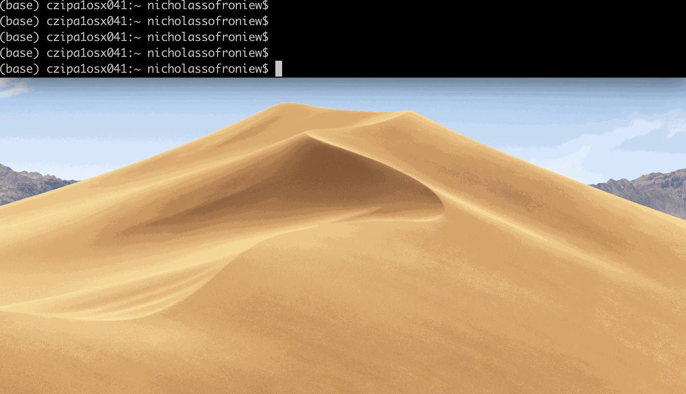
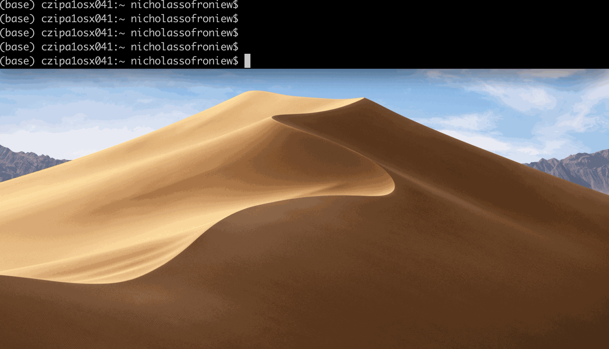
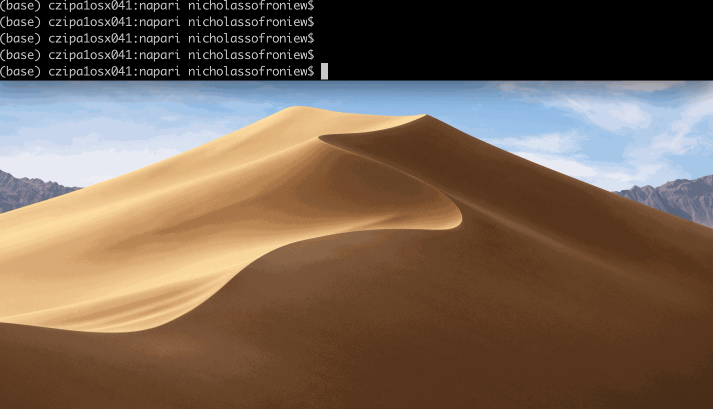
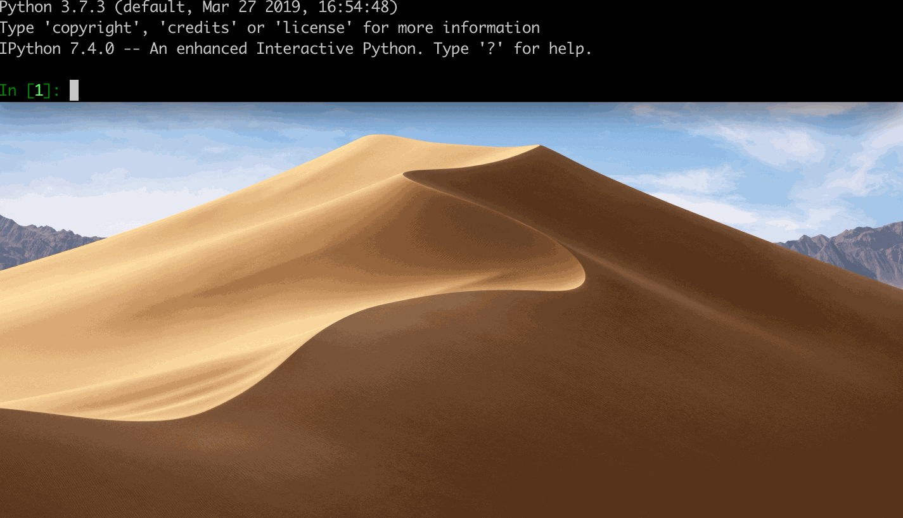
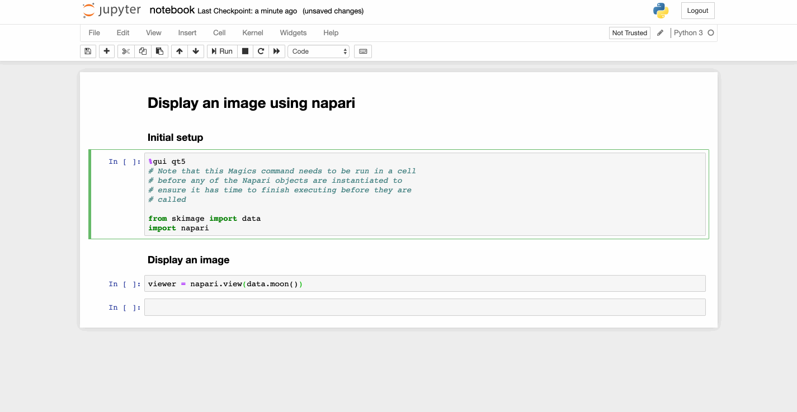
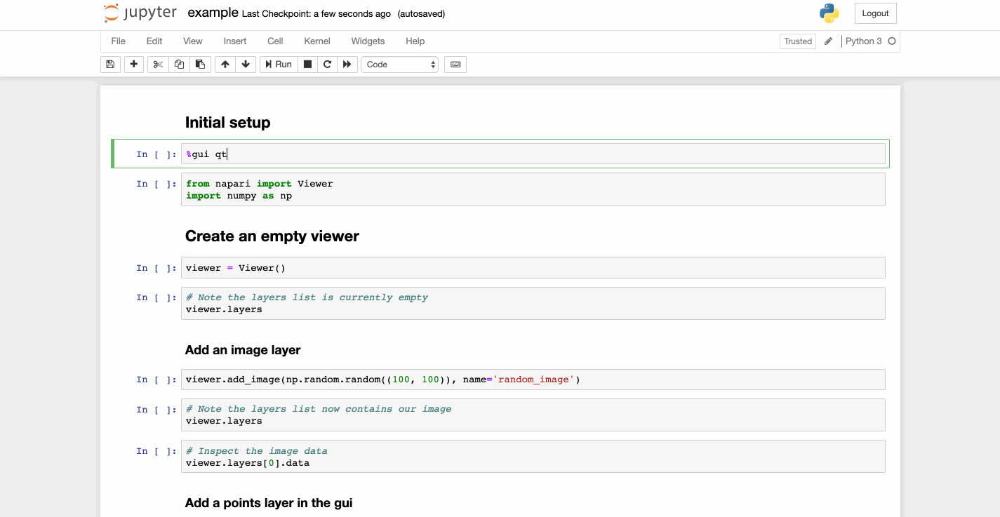

# getting started with napari

Welcome to the getting started with **napari** tutorial. This tutorial assumes you have already installed **napari**. For help with installation see our [installation tutorial](installation.md). This tutorial will teach you all the different ways to launch **napari**. At the end of the tutorial you should be able to launch **napari** and see the viewer your favourite way.


## launching napari

There are three ways to launch the **napari** viewer:
- command line
- python script
- jupyter notebook / ipython


All three of these methods will launch the same **napari** viewer, but depending on your use-case different ones may be preferable.

### command line usage

To launch **napari** from the command line simply run
```sh
napari
```

This command will launch an empty viewer as you can see below.



Once you have the viewer open you can add images through the `File/Open` dropdown menu or by dragging and dropping images directly on the viewer. We currently only support files that can be read with [`skimage.io.imread`](https://scikit-image.org/docs/dev/api/skimage.io.html#skimage.io.imread), such as `tif`, `png`, and `jpg`. We plan on adding support for more exotic file types shortly - see issue #379 for discussion. You can also create new empty `points`, `shapes`, and `labels` layers using the new layer buttons in the bottom right of the viewer.

You can also directly load an image into the viewer from the command line by passing the path to the image as an argument as follows
```sh
napari my_image.png
```
If the image is multichannel (i.e. `RGB` or `RGBA`) use the `-m` or `--multichannel` flag.



Launching **napari** directly from the command line is the simplest and fastest way to open the viewer, but it doesn't allow you to preprocess your images before opening them. It is also currently not possible to save images or other layer types directly from the viewer, but we'll be adding support for this functionality soon as discussed in #379.

### python script usage

To launch **napari** from a python script, inside your script you should import `napari`, instantiate a qt gui, and create a `Viewer` object.

Inside your script you should include:

```python
import napari

# instantiate qt gui
with napari.gui_qt():
    # create an empty viewer object
    viewer = napari.Viewer()

    # custom code to add data here
    viewer.add_image(my_image_data)
```

then run your script from the command line to launch the viewer with your data:
```sh
python my_example_script.py
```

See the scripts inside the [`examples`](../examples/add_points.py) in the main repository for examples of using napari this way.



The advantage of launching **napari** from a python script is that you can preprocess your images and add multiple layers before displaying the viewer. It is possible to save out any edits made inside the viewer by including saving code outside the `with napari.gui_qt():` context, however this can require knowing what you want to save when you write the script. You can load additional images into the viewer using the `File/Open` dropdown menu or dragging and dropping them directly on the viewer, similar to if you had launched **napari** from the command line.

### jupyter notebook / ipython usage

To launch **napari** from a jupyter notebook or ipython console, first instantiate a qt gui and then import `napari` and create a `Viewer` object.

```python
# instantiate qt gui
%gui qt5

import napari

# create an empty viewer object
viewer = napari.Viewer()

# custom code to add data here
viewer.add_image(my_image_data)
```
Note that the `Qt` gui can take a few seconds to be created and if you create the `Viewer` before it is finished the kernel will die and the viewer will not launch.



or using [`examples/notebook.ipynb`](../examples/notebook.ipynb)



One of the advantages of launching napari from an ipython console or the jupyter notebook is that you can have bidirectional between the console / notebook and the viewer. If you add data in the viewer, say by creating new layers or adding annotations like shapes, points, or labels, you will be able to instantly access that data in the console / notebook. Similarly if you continue to add or modify data in the console / notebook those changes will instantly propagate to the viewer.



Note that we currently don't support launching **napari** from a remote jupyter notebook as `Qt` is unable to create a window in that usage mode. We are interested in adding support for accessing remote data / compute with **napari** in the future.

## next steps

To learn more about how to use the **napari** viewer and the different types of **napari** layers checkout the [napari viewer tutorial](viewer.md) and more of our tutorials listed below.

## all tutorials

- [installing napari](installation.md)
- [getting started tutorial](getting_started.md)
- [napari viewer tutorial](viewer.md)
- [image layer tutorial](image.md)
- [labels layer tutorial](labels.md)
- [points layer tutorial](points.md)
- [shapes layer tutorial](shapes.md)
- [pyramid layer tutorial](pyramid.md)
- [vectors layer tutorial](vectors.md)
