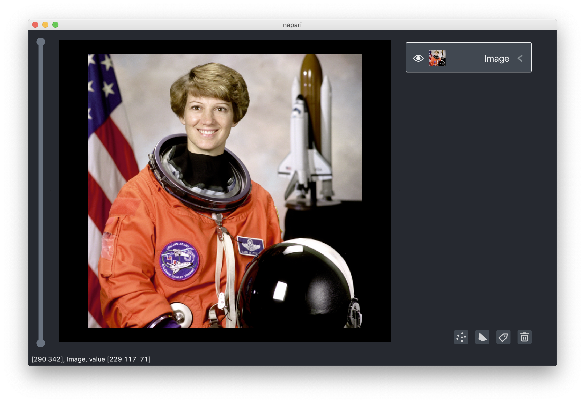
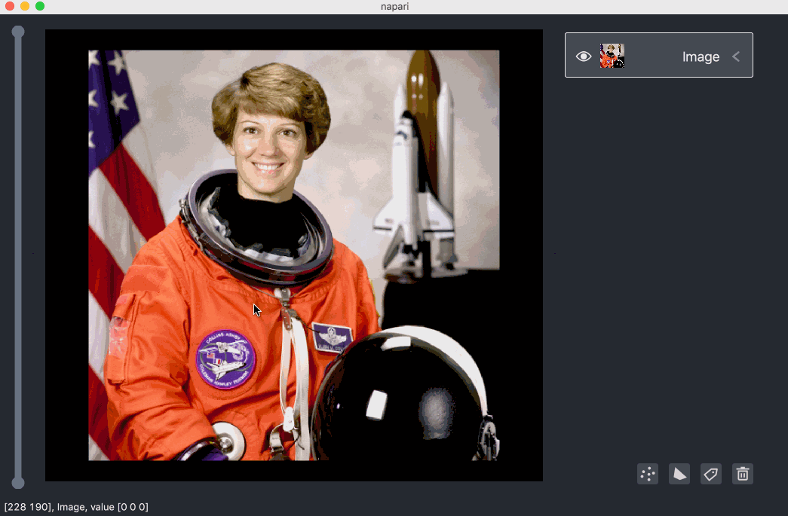
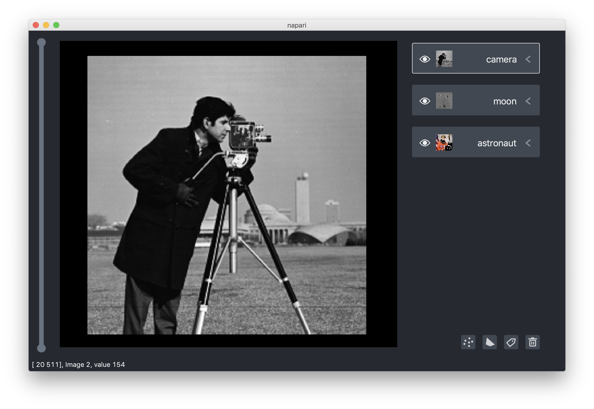
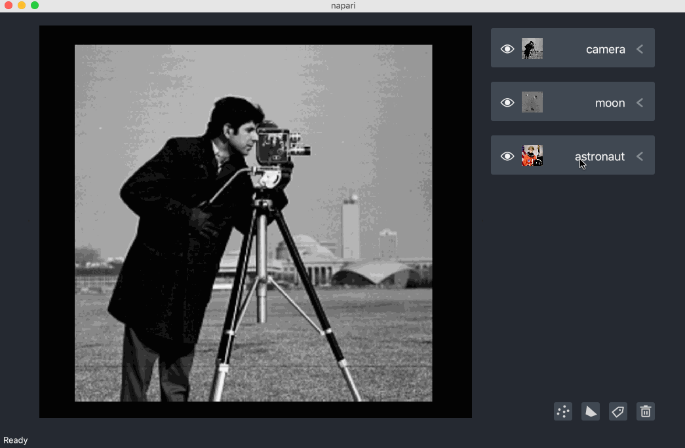
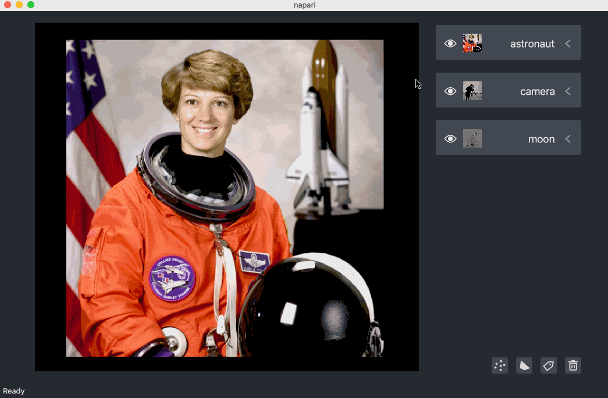
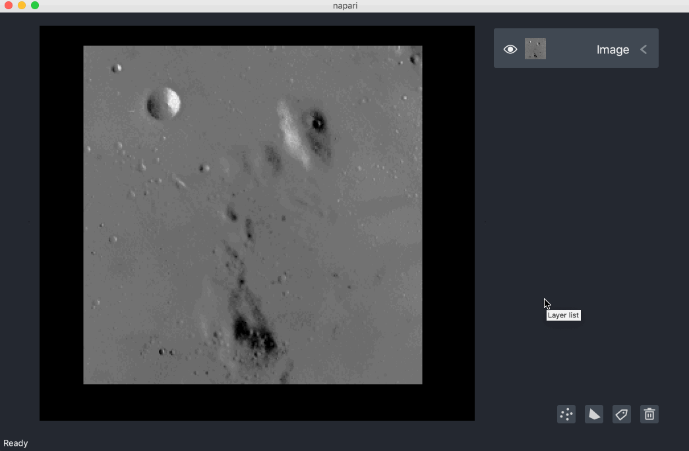
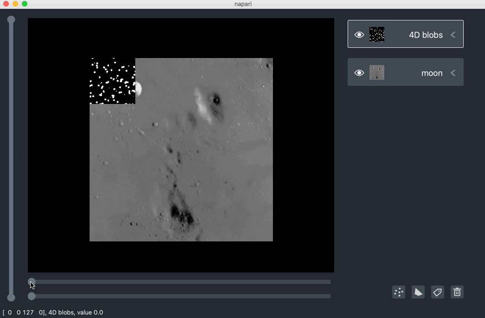
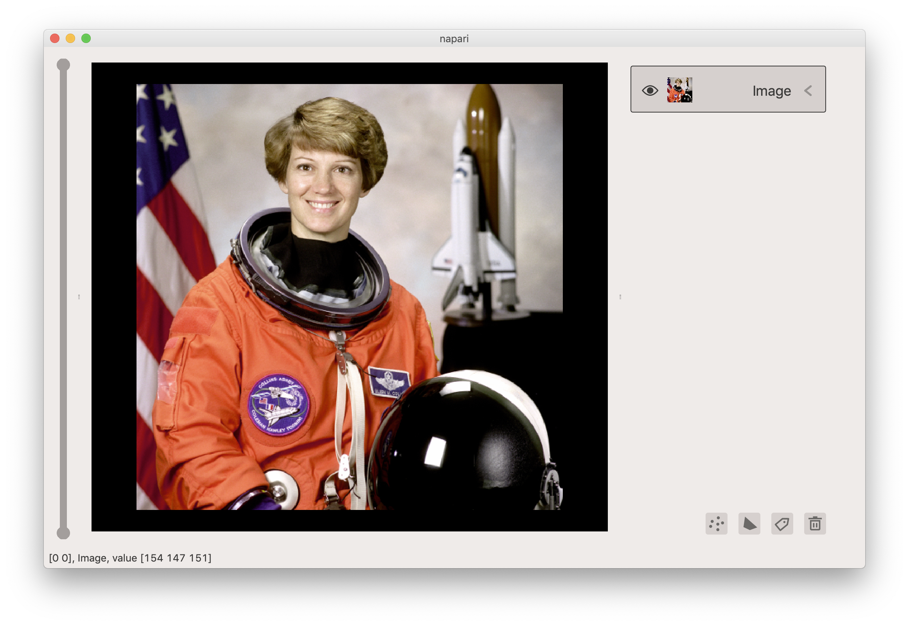

# napari viewer tutorial

Welcome to the tutorial on the **napari** viewer. This tutorial assumes you have already installed **napari** and know how to launch the viewer. For help with installation see our [installation](installation.md) tutorial. For help getting started with the viewer see [getting started](getting_started.md) tutorial. This tutorial will teach you about the **napari** viewer, including how to use it on your screen and how the data within it is organised. At the end of the tutorial you should understand the both the layout of the viewer on the screen and the data inside of it.


## launching the viewer
As discussed in [getting started](getting_started.md) tutorial the napari viewer can be launched from the command-line, a python script, or a jupyter notebook / iPython console. All three methods launch the same viewer and anything related to the interacting with the viewer on the screen applies equally to all of them. We will use the iPython console in these examples as it gives us the most control when interacting with the viewer, but the same syntax can be used in python scripts.

Let's get stated by launching a viewer with a simple 2D image.

The fasted way to get the viewer open and throw an image up on the screen is using the `napari.view` method:

```python
%gui qt5
from skimage import data
import napari

viewer = napari.view(data.astronaut())
```
Calling `napari.view` will return a `Viewer` object that is the main object inside **napari**. All the data you add to **napari** will be stored inside the `Viewer` object. It will also open the viewer to create a gui (graphical user interface) that you can interact with.

You can also create an empty `Viewer` directly and then start adding images to it. This approach can be more flexible for complex work flows, and will allow you to add other types of data like `points` and `shapes`.

```python
%gui qt5
from skimage import data
import napari

viewer = napari.Viewer()
viewer.add_image(data.astronaut())
```

After running either of those two commands you should now be able to see the photograph of the astronaut in the a **napari** viewer as shown below



Both the `view` and the `add_image` methods accept any numpy-array like object as an input, including n-dimensional arrays. For more information on adding images to the viewer see the [image layer](image.md) tutorial. Now we will continue exploring the rest of the viewer.

## layout of the viewer

The viewer is organized into a few key areas:

- main canvas
- layer list
- layer properties widgets
- layer control panel
- new layer buttons
- status bar
- dimension sliders

We'll go through each of these in the next sections.

### main canvas

The main canvas is located in the center of the viewer and contains the visual display of the data passed to **napari**, including images, point, shapes, and our other supported data types. Under the hood the canvas is a `vispy.scene.SceneCanvas` object which has built-in support for features like zooming and panning. As `vispy` uses `OpenGL` and your graphics card, panning and zooming are highly performant.



### layer list
One of the basic **napari** objects are layers. There are different layer types for `images`, `points`, `shapes`, and other basic data types. They can be added to the viewer either programatically or through the gui. Once added they start to populate the layer list is located on the righthand side of the main canvas.

The layer list contains one layer properties widget for each of the layers that have been added to the viewer. For example adding the following three layers using the code below adds three layer properties widgets as follows:

```python
%gui qt5
from skimage import data
import napari

viewer = napari.Viewer()
viewer.add_image(data.astronaut(), name=astronaut)
viewer.add_image(data.moon(), name=moon)
viewer.add_image(data.camera(), name=camera)
```



Note that we've also also named each of the layers using the `name` keyword argument in `add_image`, and that name has appeared as a string in the layer property widget.

You can select layers, causing them to become outlined, by clicking on their layer properties widget. Multiple layers can be simultaneously selected using either `shift` or `command` click to select either all the layers in between clicked on layers or just the clicked on layers respectively.

You can rearrange the order of the layers my dragging them, including dragging multiple layers at the same time.



The `Viewer` object also contains our `LayerList` object that allows you to access the data of all the layers by

```python
viewer.layers
```
This object can be index into like a normal list using an `int` or using the `str` name of the layer as follows

```python
viewer.layers[0]
viewer.layers['astronaut']
```
When you rearrange layers in the viewer you also rearrange them in the list. Similarly rearranging layers in the list rearranges them in the viewer. For example calling

```python
viewer.layers['astronaut', 'moon'] = viewer.layers['moon', 'astronaut']
```
from the console will swap the positions of the `moon` and `astronaut` layers in the viewer.


### layer properties widgets

The individual layer property widgets within the layer list contain a `visibility` icon on the lefthand side that can be toggled on or off to show or hide the layer, a thumbnail which shows a miniaturized version of the currently viewed data, a name string in which the text can be edited, and an arrow switch that can be clicked to expand the widget and show more properties that are customized for each of the different layer types. Note that the layer name is coerced into being unique so that it can be used to index into the `LayerList`.

Interacting with the layer properties widgets looks as follows:



Adjusting these properties in the gui will cause corresponding changes to properties on the individual layers that are accessible in the console through `viewer.layers`.

These properties can also be changed within the console as follows:

```python
viewer.layers['camera'].name = 'photographer'
viewer.layers['astronaut'].visible = False
```

and these changes will instantly propagate to the gui. For more information about the different properties for different layer types checkout our layer specific tutorials listed below.

### layer control panel

On the lefthand side of the main canvas is a thin vertical control panel that is used to display more layer specific controls. To get a sense of it's full usage we'll start a new example with both `Image` and `Points` layers, where a `Points` layer is used to display 2D markers at different locations.

```python
%gui qt5
from skimage import data
import numpy as np
import napari

viewer = napari.Viewer()
viewer.add_image(data.moon(), name=moon)
viewer.add_points(512 * np.random.random((20, 2)), name=spots, size=20, face_color='red')
```
This example has added 20 red markers to a `Points` layer which we have named `spots`. You'll note that as we select the two different layers different interactive elements appear in the layer control panel. When we have the `moon` selected then a slider appears, when we have `spots` selected four different buttons appear, and when we have neither or both layers selected no elements appear. These elements allow you to control global properties of the layer like the contrast slider for an `Image` layer, or allow you to add and select points for a `Points` layer. For more information about the different elements in the control panel for different layer types checkout our layer specific tutorials listed below.

Here is a demo of interactivity for the `Image` and `Points` layers in the example above.


### new layer buttons
New `Points`, `Shapes`, and `Labels` layers can be added to the viewer using the new layer buttons in the bottom righthand corner of the gui. These correspond to the calls

```python
viewer.add_points(data)
viewer.add_shapes(data)
viewer.add_labels(data)
```
but with empty data. Once added in the gui these layers become accessible in the layers list and at `viewer.layers`.

Layers can also be deleted by selecting them and the clicking on the trash icon, the far right button, or by dragging the layers and dropping them into the trash.

In the console a layer at index `i` can be removed by
```python
viewer.layers.pop(i)
```

Adding and deleting layers from the gui looks as follows



Notice here how we added two `Points` layers and used the layer properties widget to change their colors. We then added a `Shapes` layer which allowed us to draw some rectangles, before we deleted all our new layers.

### status bar

At the very bottom of the gui there is a status bar that contains useful updates and tips.

On the lefthand side of the status bar there is a message that contains information about the position of the mouse and the values of any images or the indices of any points that are currently hovered over, depending on which layer is selected. The status bar will also display information about what button you are clicking in the layer control panel too.

The righthand side of the status bar contains some helpful tips depending on which layer and tools are currently selected.

You should be able to see examples of the status bar changing as the cursor moves in our examples above.

## dimension sliders
One of the main strengths of **napari** is that it has been designed from the beginning to handle n-Dimensional data. While much consumer photography is 2D and `RGB`, scientific image data can often be volumetric (i.e. 3D), volumetric timeseries (i.e. 4D), or even higher dimensional. **napari** places no limits on the dimensionality of its input data for all of its layer types.

Adding data with a dimensionality greater than 2D will cause dimension sliders to appear directly underneath the main canvas and above the status bar. As many sliders as needed will appear to ensure the data can be fully browsed. For example a 3D dataset needs one slider, a 4D dataset needs two sliders, and so on.

It is also possible to mix data of different shapes and dimensionality in different layers. If a 2D and 4D dataset are both added to the viewer then the sliders will only affect the 4D dataset and the 2D dataset will be remain the same.

For example the following commands from the console will add a 2D and 4D datasets to the same viewer:

```python
%gui qt5
from skimage import data
import napari

viewer = napari.Viewer()
viewer.add_image(moon, name='moon')
blobs = np.stack(
    [
        data.binary_blobs(
            length=128, blob_size_fraction=0.05, n_dim=3, volume_fraction=f
        )
        for f in np.linspace(0.05, 0.5, 10)
    ],
    axis=0,
).astype(float)
viewer.add_image(blobs, name='4D blobs')
```



Notice how there are two dimensions sliders located beneath the main canvas and
adjusting them affects only the `4D blobs` data.

The multidimensional slides conclude our exploration of the layout of the viewer.

## changing viewer theme

Currently, **napari** comes with two different themes `light` and `dark`, which is the default.
To change the theme just update `theme` property of the viewer, for example
```python
viewer.theme = 'light'
```



Adding your own custom theme isn't too hard either but does require creating your own color `palette`
and rebuilding the icons. If people want more themes, we're happy to add them or if you look checkout
our [Contributing Guidelines](../CONTRIBUTING.md) for more information about building the icons and
add one yourself!

## custom keybinding

One of the promises of **napari** is to provide a beginner friendly environment for interactive
analysis. For example we want to enable workflows where people can interact with the gui, say
click on the centers of some objects, or paint over some regions and then perform custom analysis.
As a first step towards enabling custom interactivity we've provided support to add your own custom
keybindings to the `Viewer` or individual `Layer` objects such that when the corresponding key gets
clicked your custom function gets executed. Depending on which object you bind your key too your function
will either get access to the state of the entire `viewer` or `layer` object.

For example to bind function that loops through all layers in the viewer and prints their names when you
press the `p` key you can do the following:

```python
%gui qt5
import napari

viewer = napari.Viewer()

@viewer.bind_key('p')
def print_names(viewer):
  print([layer.name for layer in viewer.layers])
```

By default your key will bind to the key press event, but it is also possible to bind to the key release
event by including a `yield` inside your function. All code before the `yield` will get executed on key
press and all code after the `yield` will get executed on key release.

```python
%gui qt5
import napari

viewer = napari.Viewer()

@viewer.bind_key('m')
def print_message(viewer):
  print('hello')
  yield
  print('goodbye')
```

## next steps

Hopefully this tutorial has given you an overview of the functionality available on the **napari** viewer, including
the `LayerList` and some of the different layer types. To learn more about the different layer types that **napari** supports checkout some more of our tutorials listed below. The [image layer](image.md) tutorial is a great one to try next as viewing images is a fundamental part of what **napari** is about.

## all tutorials

- [installing napari](installation.md)
- [getting started tutorial](getting_started.md)
- [napari viewer tutorial](viewer.md)
- [image layer tutorial](image.md)
- [labels layer tutorial](labels.md)
- [points layer tutorial](points.md)
- [shapes layer tutorial](shapes.md)
- [pyramid layer tutorial](pyramid.md)
- [vectors layer tutorial](vectors.md)
